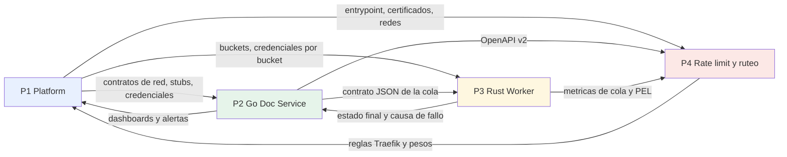

# Pasos Iniciales — Migración de Monolito a Microservicios

> **Documento de ejecución.** Deriva del SDD `arquitectura.md` (**v2.1**, patrón Strangler Fig + SAGA).
> Convierte ese diseño en un plan día a día con **una persona asignada por tarea**, criterios de
> aceptación verificables, dependencias explícitas y puertas de calidad (Go/No-Go) entre fases.
>
> **v1.1 — cambios incorporados tras la revisión de v2.1 del SDD:** paridad redefinida como
> equivalencia del resultado y no de respuestas HTTP · S0 tiene la estrategia de compatibilidad de
> clientes (ADR) · el shadow traffic se reemplaza por replay de corpus · el autoescalado se reformula
> como alerta + escala manual (Docker Compose no tiene HPA) · mTLS pasa a tarea opcional y deuda
> declarada · ADRs nuevas para el host de S3, la validación post-subida y `REJECTED`, y la
> migración de clientes · riesgos nuevos de PDF hostil, TTL sobre documentos ya subidos y clientes
> que no migran.

| Campo | Valor |
|---|---|
| Versión del documento | 1.1 |
| Fecha de referencia de inicio | lunes 2026-09-28 (ajustar a la fecha real de arranque) |
| Duración | 10 semanas de migración + 1 semana de cimientos (11 semanas) + cierre del contrato v1 hasta la fecha límite acordada |
| Tamaño del equipo | 4 personas |
| Stack | Traefik v3, Go/Gin, Rust/Tokio, MinIO, Redis Streams, MongoDB Replica Set |
| Estilo | Trunk-based development, arquitectura orientada a eventos, SAGA orquestada |

---

## Índice

1. [Cómo usar este documento](#1-cómo-usar-este-documento)
2. [Equipo, roles y responsabilidades](#2-equipo-roles-y-responsabilidades)
3. [Reglas de trabajo y definiciones](#3-reglas-de-trabajo-y-definiciones)
4. [Mapa de fases y puertas de calidad](#4-mapa-de-fases-y-puertas-de-calidad)
5. [Semana 0 — Cimientos del equipo y de los repos](#5-semana-0--cimientos-del-equipo-y-de-los-repos)
6. [Fase 1 — Infraestructura base (Semanas 1-2)](#6-fase-1--infraestructura-base-semanas-12)
7. [Fase 2 — Document Management Service en Go (Semanas 3-4)](#7-fase-2--document-management-service-en-go-semanas-34)
8. [Fase 3 — Extraction Worker en Rust (Semanas 5-6)](#8-fase-3--extraction-worker-en-rust-semanas-56)
9. [Fase 4 — Rate limiting y ruteo Strangler (Semanas 7-8)](#9-fase-4--rate-limiting-y-ruteo-strangler-semanas-78)
10. [Fase 5 — Cutover y retirada del monolito (Semanas 9-10)](#10-fase-5--cutover-y-retirada-del-monolito-semanas-910)
    - [Fase 6 — Migración de clientes y cierre del contrato v1](#10-fase-5--cutover-y-retirada-del-monolito-semanas-910) (hasta la fecha límite acordada, se detalla al final de la Fase 5)
11. [Contratos técnicos de referencia](#11-contratos-técnicos-de-referencia)
12. [ADRs — Registro de decisiones arquitectónicas](#12-adrs--registro-de-decisiones-arquitectónicas)
13. [Registro de riesgos](#13-registro-de-riesgos)
14. [Runbooks de rollback](#14-runbooks-de-rollback)
15. [SLOs, KPIs y presupuesto de error](#15-slos-kpis-y-presupuesto-de-error)
16. [Checklist Go/No-Go del corte](#16-checklist-gono-go-del-corte)
17. [Trampas conocidas por stack](#17-trampas-conocidas-por-stack)
18. [Glosario y comandos de referencia](#18-glosario-y-comandos-de-referencia)
19. [Cierre de la migración y siguiente etapa](#19-cierre-de-la-migración-y-siguiente-etapa)

---

## 1. Cómo usar este documento

### 1.1 Convenciones

- **Identificador de tarea:** `S<semana>-P<persona>-<n>`. Ejemplo: `S3-P2-04`.
  Toda referencia entre tareas usa este ID, de modo que las dependencias sean verificables.
- **Personas:** se identifican como `P1`, `P2`, `P3`, `P4`. Cuando el equipo asigne nombres
  reales, se sustituyen en este documento una sola vez.
- **Estado de una tarea:** `PENDIENTE` -> `EN CURSO` -> `EN REVISION` -> `HECHA` / `BLOQUEADA`.
  Una tarea `HECHA` exige cumplir su criterio de aceptación, no solo "funciona en mi maquina".
- **Prioridad:** `P0` (bloquea otras tareas) - `P1` (necesaria en la semana) - `P2` (deseable).
- **Fechas:** las fechas son de referencia. Si el arranque se mueve, se recalcula el calendario
  conservando el orden y las dependencias; **nunca se reordena una dependencia** (ver seccion 4).

### 1.2 Regla de oro

> Si una tarea no tiene **criterio de aceptación verificable** y **persona asignada**, no entra al tablero.
> Si una dependencia no esta `HECHA`, la tarea dependiente se marca `BLOQUEADA`, no "en curso a medias".

### 1.3 Ceremonias (timeboxes fijos, dentro de jornada)

| Ceremonia | Cuando | Duracion | Participantes | Salida obligatoria |
|---|---|---|---|---|
| Planning de semana | Lunes 09:30 | 45 min | Las 4 | Tablero de la semana con owners |
| Daily sync | Diario 09:45 | 15 min | Las 4 | Bloqueos declarados en el canal |
| Revision de arquitectura | Miercoles 15:00 | 60 min | Las 4 | ADRs nuevas o revisadas y registradas |
| Pair programming | Jueves 10:00-12:00 | 120 min | Pareja asignada segun seccion 2.4 | Commit compartido con nota de pair |
| Demo + retrospectiva | Viernes 16:00 | 60 min | Las 4 | Demo funcional + 3 acciones de mejora con owner |

---

## 2. Equipo, roles y responsabilidades

### 2.1 Asignacion por especialidad

| Persona | Rol | Especialidad | Es dueno de (produce y mantiene) |
|---|---|---|---|
| **P1** | Platform / DevOps / SRE | Docker, Traefik, MinIO, Redis, MongoDB, Prometheus, Grafana, Loki, CI/CD, redes, secretos | Topologia de infraestructura, gateways, compose y manifests, observabilidad, pipelines, backups, mTLS |
| **P2** | Backend Engineer (Go) | Go, Gin, MongoDB Driver, Redis, URL prefirmadas, Change Streams, SAGA | `doc-service`: API de documentos, webhook MinIO, relay Change Streams, maquina de estados, job de reconciliacion |
| **P3** | Systems Engineer (Rust) | Rust, Tokio, Actix-web, Redis Streams, `pdf-extract`/`lopdf`, resiliencia | `extraction-worker`: consumer group, extraccion, Retry + Circuit Breaker, Bulkhead, DLQ, compensacion |
| **P4** | Integration & Quality Engineer | Go (servicio de rate limit), Traefik ForwardAuth, k6, OpenAPI, contrato, Python legacy | `platform-services/rate-limiter`, reglas de ruteo Strangler, pruebas E2E/contrato/carga, canary y cutover, runbooks |

### 2.2 Por que esta division

- **Verticales auto-contenidos (Inverse Conway).** Cada persona conoce a fondo su servicio, su
  pipeline y su stack. Es la forma mas rapida de que un equipo junior suba de nivel: hay un
  referente claro por tecnologia, en lugar de que cuatro personas toquen cuatro piezas de un mismo
  sistema y nadie sea dueno del conjunto.
- **P1 es el cuello de botella conocido.** Toda fase que toque infraestructura depende de P1.
  Mitigacion: las fases 2 y 3 (que son las mas pesadas de codigo) corren en paralelo con la fase 1
  usando stacks locales de desarrollo, y P1 entrega primero los *contratos* de red, no los servidores.
- **P4 no es "el que hace QA" al final.** P4 construye el arnes de pruebas y el enrutamiento desde
  la semana 0, porque en un sistema distribuido el testing es una herramienta de desarrollo, no una
  etapa final.

### 2.3 Matriz RACI de los entregables principales

R = Responsible (lo ejecuta) - A = Accountable (lo aprueba, uno solo) - C = Consulted - I = Informed

| Entregable | P1 | P2 | P3 | P4 |
|---|---|---|---|---|
| Topologia de infraestructura y redes | **A/R** | C | C | C |
| Despliegue Traefik + ACME + mTLS | **A/R** | I | I | C |
| MinIO: buckets, politicas, identidades, lifecycle | **A/R** | C | C | I |
| Redis: AOF, ACL, politica de memoria, Sentinel | **A/R** | I | C | C |
| MongoDB Replica Set, indices, usuario de app | **A/R** | **R** | I | I |
| Contrato de mensajes de la cola (JSON) | I | **A** | **R** | C |
| Document Management Service | C | **A/R** | C | C |
| Maquina de estados de la SAGA | C | **A/R** | C | I |
| Job de reconciliacion | C | **A/R** | C | I |
| Extraction Worker | C | C | **A/R** | C |
| Retry + Circuit Breaker (composicion) | C | C | **A/R** | C |
| DLQ y herramientas de replay | I | C | **A/R** | I |
| Servicio `rate-limiter` (ForwardAuth) | C | I | I | **A/R** |
| Reglas Strangler de Traefik | **R** | C | C | **A** |
| Suite E2E y de contrato | C | C | C | **A/R** |
| Replay de corpus y canary | C | C | C | **A/R** |
| Cutover y retirada del monolito | **R** | C | C | **A** |
| Runbooks y documentacion operativa | **A/R** | R | R | **R** |
| Auditoria de seguridad final | **A/R** | R | R | R |

### 2.4 Parejas de pair programming (obligatorios)

El equipo es junior en microservicios. Estas sesiones son **no negociables** y estan agendadas en
el calendario de cada semana.

| Momento | Pareja | Tema | Por que |
|---|---|---|---|
| Semana 0, jueves | P2 + P3 | Contrato de mensajes y semantica de Redis Streams | Es la frontera mas sutil del sistema |
| Semana 1, jueves | P1 + P2 | Conexiones a Mongo, pools, `writeConcern`, Change Streams | Replica Set y Change Streams no fallan de forma obvia |
| Semana 3, jueves | P2 + P3 | Idempotencia y compensaciones de la SAGA | Doble idempotencia: mensaje y escritura |
| Semana 5, jueves | P2 + P3 | Composicion Retry / Circuit Breaker / Timeout | Un orden incorrecto provoca retry storms |
| Semana 7, jueves | P1 + P4 | Traefik: ForwardAuth, pesos de canary, router del host de S3 y exposicion | Configuracion distribuida, facil de romper en silencio |
| Semana 9, jueves | Todas | Game day de rollback | Todo el equipo debe saber revertir |

Regla adicional: **toda tarea marcada `P0` que toque consistencia, idempotencia o el camino critico
de seguridad requiere revision de al menos dos personas** (un PR no se aprueba solo por el autor).

---

## 3. Reglas de trabajo y definiciones

### 3.1 Ramas y commits

- **Trunk-based.** `main` siempre desplegable a `staging`.
- Ramas: `feat/<servicio>-<corto>`, `fix/<servicio>-<corto>`, `chore/<repo>-<corto>`.
- Duracion objetivo de rama: **2 dias o menos**. Si dura mas, se divide.
- Commits convencionales: `feat`, `fix`, `refactor`, `test`, `docs`, `build`, `chore`.
- Sin `force push` sobre `main`. Rebase por defecto; merge squash solo para PRs de mas de 20 archivos.
- Nada de secretos ni `.env` reales en el repo: solo `.env.example` con valores ficticios.

### 3.2 Pull requests

- Un PR = una tarea del documento (o un grupo cohesivo y pequeno). Si el PR supera unas 400 lineas
  de cambios funcionales, se divide.
- **CI verde obligatorio**: lint, tests unitarios, tests de integracion, build de imagen, escaneo
  de dependencias (Trivy/Grype), escaneo de secretos (gitleaks/trufflehog).
- Un PR requiere **1 aprobacion** como minimo; las tareas `P0` de consistencia requieren **2**.
- El PR debe describir: *que cambia*, *por que*, *como se prueba*, *como se revierte*.
- Todo PR que toque la maquina de estados incluye **test del caso de transicion** y actualiza el
  diagrama de estados si el flujo cambio.

### 3.3 Definition of Ready (una tarea puede iniciarse solo si)

1. Tiene ID, owner unico y criterio de aceptacion verificable.
2. Sus dependencias estan `HECHA` (o el bloqueo esta documentado y aceptado).
3. El contrato de entrada/salida esta definido (schema, endpoint o evento) por escrito.
4. Existe un criterio observable para probarla (test, comando o medicion).

### 3.4 Definition of Done global (aplica a toda tarea `HECHA`)

1. Codigo en `main`, en el repositorio correcto, con CI verde.
2. Tests: unitarios para logica de negocio e integracion para todo lo que toque Mongo/Redis/MinIO.
3. **Logs estructurados JSON** con `correlation_id` y `document_id` presentes donde aplique.
4. **Metricas** expuestas si el componente tiene comportamiento observable (colas, latencia, errores).
5. **`/readyz` verifica dependencias reales**, no solo que el proceso esta vivo.
6. Timeouts explicitos en cada llamada de red (MinIO, Mongo, Redis), nunca defaults implicitos.
7. El cambio es reversible: se documenta el comando o el paso de rollback.
8. Documentacion actualizada (OpenAPI, README, runbook o ADR segun corresponda).

### 3.5 Criterios de seguridad no negociables

Aplican a todas las fases y se verifican en el checklist final:

1. Nunca se usa la cuenta root de MinIO, Mongo o Redis en una aplicacion.
2. Ningun secreto en el repositorio; todo secreto vive en el secret store del orquestador.
3. El endpoint webhook de MinIO no es alcanzable desde internet.
4. Se valida la cabecera magica `%PDF-`, no solo el `Content-Type`.
5. Contenedores con usuario no-root, filesystem de solo lectura y capabilities revocadas.
6. Toda transicion de estado se hace con filtro de estado esperado (transiciones condicionales).

---

## 4. Mapa de fases y puertas de calidad

### 4.1 Calendario de referencia

| Semana | Fechas | Fase | Entregable de cierre |
|---|---|---|---|
| S0 | 28/09 - 02/10 | Cimientos | 4 repos con CI verde, ADRs, linea base medida |
| S1 | 05/10 - 09/10 | F1 Infraestructura | Traefik + MinIO + Redis + Mongo RS desplegados |
| S2 | 12/10 - 16/10 | F1 Infraestructura | Observabilidad, backups verificados, health checks reales |
| S3 | 19/10 - 23/10 | F2 Document Service | API + webhook + relay funcionando |
| S4 | 26/10 - 30/10 | F2 Document Service | SAGA completa + reconciliador + caos #1 y #2 |
| S5 | 02/11 - 06/11 | F3 Worker | Extraccion real + resiliencia completa |
| S6 | 09/11 - 13/11 | F3 Worker | DLQ operable + endurance 24 h |
| S7 | 16/11 - 20/11 | F4 Rate limit + Strangler | rate-limiter + reglas de ruteo + host S3 verificado |
| S8 | 23/11 - 27/11 | F4 Rate limit + Strangler | Replay de corpus con paridad de texto + canary 1-10 % |
| S9 | 30/11 - 04/12 | F5 Cutover | Migración de clientes en curso + auditoria + game day |
| S10 | 07/12 - 11/12 | F5 Cutover | 100 % trafico nuevo + monolito apagado (0 trafico legacy 7 dias) |

### 4.2 Resumen de fases, semanas y responsables

Las semanas se cuentan **desde el inicio de F1**. La semana 0 (cimientos) es previa y no se numera
dentro de las 10 semanas de migración: por eso F1 es 1-2, F2 es 3-4, y así sucesivamente.

| Fase | Semanas | Objetivo | Producto | Dueno de la fase |
|---|---|---|---|---|
| S0 | previa (0) | Cimientos del equipo, repos y linea base medible | 4 repos, ADRs, toolchains, baseline de rendimiento, estrategia de clientes | P4 (coordinacion) |
| F1 | 1-2 | Infraestructura base operativa y observable | Traefik (API + host S3), MinIO, Redis, Mongo RS, stack de observabilidad | P1 |
| F2 | 3-4 | Document Management Service completo | API + webhook + relay + SAGA + reconciliacion | P2 |
| F3 | 5-6 | Extraction Worker completo | Extraccion, consumer group, DLQ, compensacion | P3 |
| F4 | 7-8 | Rate limiting real y ruteo con cambio gradual | `rate-limiter`, reglas Strangler, replay de corpus | P4 |
| F5 | 9-10 | Cutover y retirada del monolito | 100 % trafico en servicios nuevos, monolito apagado | P4 (con P1) |
| F6 | posterior, hasta la fecha limite acordada | Migracion de clientes y cierre del contrato v1 | 0 trafico al camino viejo, excepciones inventariadas | P4 (con el negocio) |

### 4.3 Puertas Go/No-Go

No se avanza de fase sin cumplir su puerta. La decision se toma en la revision de arquitectura del
miercoles y queda registrada como ADR o nota de decision.

| Puerta | Momento | Criterios para decir **Go** | Si es **No-Go**: contingencia |
|---|---|---|---|
| G0 -> F1 | Fin S0 | ADRs firmados (incluida la de compatibilidad de clientes), 4 repos con CI verde, linea base del monolito medida, toolchains instaladas | Semana de refuerzo; no se toca produccion hasta cumplir |
| G1 -> F2 | Fin S2 | Stack desplegable con un comando, host publico de S3 con certificado valido, buckets y ACLs creados, `/readyz` verdes, 1 dashboard util, backup de Mongo probado **restaurando** | Se corrige en S+1; F2 avanza solo con stacks locales de datos documentados |
| G2 -> F3 | Fin S4 | E2E del camino feliz funciona extremo a extremo, SAGA cubre todas las transiciones (incluida `REJECTED`), el reconciliador detecta un huerfano inyectado a mano | F3 avanza en modo "solo lectura": el worker no consume mensajes reales hasta que G2 sea Go |
| G3 -> F4 | Fin S6 | DLQ y replay funcionando, 100 % de estados terminales tras el failover, recuperacion de los mensajes perdidos por el failover medida | DLQ en modo pasivo; se replica la extraccion en paralelo sin escribir |
| G4 -> F5 | Fin S8 | Replay de corpus con paridad del texto extraido >= 99.9 % en dos ejecuciones consecutivas, rate limit correcto bajo carga, error rate < 0.1 % | No hay canary; se repite la semana de replay con corpus ampliado |
| G5 -> cierre | Fin S10 | 0 documentos huerfanos, 0 errores de seguridad criticos, runbooks probados, clientes migrados o con exencion firmada, monolito apagado y reversible | Rollback al monolito mediante regla de ruteo (ver seccion 14) |

### 4.4 Mapa de dependencias entre personas



**Regla de bloqueo:** si P1 no entrega un stub o una credencial en la fecha pactada, quien dependa
de el levanta un stack local por Docker (`minio`, `redis`, `mongo`) y lo deja documentado como
deuda tecnica con fecha de cierre. Nunca se bloquea la implementacion por una infra.

---

## 5. Semana 0 — Cimientos del equipo y de los repos

**Objetivo:** que las 4 personas puedan crear, compilar, testear y desplegar en local su componente
sin ayuda, y que exista una medida objetiva de como funciona el monolito **antes** de tocarlo.

**Puerta de salida G0:** ADRs firmados, 4 repos con CI verde, linea base medida, toolchains listas.

### 5.1 Calendario dia a dia — Semana 0

| Dia | P1 — Platform | P2 — Go / Doc Service | P3 — Rust / Worker | P4 — Integracion / Calidad | Hito |
|---|---|---|---|---|---|
| Lun 28/09 | Crear los 4 repos y el esqueleto de ramas | Leer `arquitectura.md` secciones 1-5 y anotar dudas | Leer `arquitectura.md` secciones 3.3, 5.4, 7; instalar Rust estable | Leer `arquitectura.md` completo y listar preguntas abiertas | Repos creados |
| Mar 29/09 | Toolchains: Go, Rust, `mc`, `trivy`, `gitleaks` | Esqueleto Go por capas con `/healthz` que responde | Esqueleto Rust (Tokio + Actix) con `/healthz` | Inventario de endpoints del monolito **y de los clientes que los consumen** (de entrada, para `S0-P4-07`) | Build en verde en los 2 servicios |
| Mié 30/10 | Compose v2 de desarrollo (perfiles `core`, `full`, `chaos`); **decision del hostname publico de S3 con DNS y certificado** (`S0-P1-07`) | Configuracion por entorno con validacion al arranque (falla rapido) | Configuracion por entorno con validacion al arranque | **Medir la linea base del monolito** con k6 (p50/p95/p99, throughput, errores) | Linea base publicada |
| Jue 01/10 | Escaneo de secretos en pre-commit y en CI | **Pair P2+P3**: contrato de mensajes JSON e **intentos contados con `XPENDING` delivery count** (el mensaje ya no lleva `attempts`) | **Pair P2+P3**: mismo objetivo, centrado en la estructura del mensaje | Redactar ADR-0001 y ADR-0002 | Contrato de mensajes versionado |
| Vie 02/10 | Runners de CI y cache de dependencias | Test minimo de integracion con Mongo | Test minimo de integracion con Redis | Definicion de paridad **por resultado** (`S0-P4-06`), borrador de la estrategia de clientes (ADR-0018) y plantilla de PR con CODEOWNERS | Demo del esqueleto + retrospectiva |

### 5.2 Detalle de tareas — Semana 0, P1 (Platform / DevOps)

| ID | Tarea | Detalle tecnico | Criterio de aceptacion (DoD) | Depende de | Prio |
|---|---|---|---|---|---|
| `S0-P1-01` | Crear los 4 repositorios y su estructura | `infra/`, `doc-service/`, `extraction-worker/`, `platform-services/` (contendra `rate-limiter/`). Ramas `main` protegidas, CODEOWNERS, README que dice que hace y que no hace | Cada repo tiene README, licencia, `.gitignore`, plantilla de PR y CI que corre en el primer push | — | P0 |
| `S0-P1-02` | Toolchains documentadas y versionadas | Version de Go fijada en `go.mod`, canal estable fijado en `rust-toolchain.toml`, versiones de `traefik`, `minio`, `redis`, `mongo` fijadas por tag, y `scripts/bootstrap.sh` que verifica el entorno | Una persona nueva ejecuta el script y queda con todo instalado; si falta algo, el script dice que y como se instala | `S0-P1-01` | P0 |
| `S0-P1-03` | Compose de desarrollo | Perfiles: `core` (Mongo + Redis + MinIO), `full` (todo + Traefik + Prometheus + Grafana), `chaos` (con opciones para matar procesos). Puertos locales sin colisiones | `docker compose --profile full up` levanta el stack completo en una sola orden, en menos de 3 minutos, sin errores | `S0-P1-01` | P0 |
| `S0-P1-04` | Seguridad del pipeline desde el outset | `gitleaks` en pre-commit y en CI; imagenes base con pin por digest; usuario no-root en todos los Dockerfiles | Un secreto de prueba (insertado y luego revertido) es detectado por el escaner | `S0-P1-01` | P0 |
| `S0-P1-05` | Redes y politica de base | Redes `edge` (con salida a internet), `internal` (sin salida a internet), `data` (solo datos, sin salida) | Ningun servicio de datos tiene ruta a internet; verificado con `docker network inspect` | `S0-P1-03` | P0 |
| `S0-P1-06` | Limites de recursos por defecto | Todos los contenedores con `mem_limit` y limite de CPU definidos desde el inicio | `docker stats` no muestra servicios sin limite | `S0-P1-03` | P1 |
| `S0-P1-07` | Decidir el hostname y entrypoint publico de MinIO | Nombre del host dedicado para S3 (ej. `s3.dominio`), registro DNS, router de Traefik previsto y **certificado** de staging si el ACME ya esta disponible. **Debe resolverse antes de `S1-P1-04`**: la firma SigV4 depende del host, y si el doc-service emite la URL prefirmada con un host distinto del que el cliente golpea, todo upload falla con `SignatureDoesNotMatch` en produccion | El nombre esta decidido y documentado como ADR-0016, el DNS resuelve, y una subida de prueba con URL prefirmada contra ese host funciona con certificado valido | `S0-P1-01` | P0 |

### 5.3 Detalle de tareas — Semana 0, P2 (Backend Go)

| ID | Tarea | Detalle tecnico | Criterio de aceptacion (DoD) | Depende de | Prio |
|---|---|---|---|---|---|
| `S0-P2-01` | Esqueleto del servicio por capas | `cmd/api/main.go`, `internal/domain` (entidades y transiciones), `internal/ports` (interfaces), `internal/adapters` (Mongo, MinIO, Redis), `internal/transport/http` (handlers). La logica de negocio no importa librerias de infraestructura | Un test unitario de una transicion de estado corre sin Docker ni red | `S0-P1-01` | P0 |
| `S0-P2-02` | Configuracion con fallo rapido | Lectura de env con valores por defecto seguros y validacion al arranque: si falta una variable obligatoria, el proceso muere diciendo cual falta y donde obtenerla | El proceso no arranca con `MINIO_ENDPOINT` vacio y lo dice por log en menos de 1 s | `S0-P2-01` | P0 |
| `S0-P2-03` | Logging estructurado y `correlation_id` | Logger JSON con `timestamp`, `level`, `service`, `correlation_id`, `document_id`, `msg`, `error`. Middleware que lee o genera `X-Correlation-Id` y lo propaga a las salidas y a todas las llamadas salientes | Dada una peticion con header, todas las lineas de esa peticion comparten el mismo `correlation_id` | `S0-P2-01` | P0 |
| `S0-P2-04` | Manejo de errores y apagado limpio | Taxonomia de errores (`validation`, `not_found`, `conflict`, `dependency_unavailable`, `internal`), mapa a codigos HTTP, y apagado por `SIGTERM` con drenaje de requests en vuelo y del relay de Change Streams | Un `SIGTERM` durante una request larga no corta la request ni deja conexiones colgadas | `S0-P2-02` | P0 |
| `S0-P2-05` | Diseno del documento de Mongo | Documento BSON con `_id` (ULID), `status`, `object_key`, `txt_ref`, `attempts`, `created_at`, `updated_at`, `expires_at`, `correlation_id`, `schema_version`. Indices: `status`, `updated_at`, TTL sobre `expires_at`, unico sobre `_id` | Existe un documento de diseno versionado con ejemplo completo de documento y cada indice justificado | `S0-P2-01` | P0 |
| `S0-P2-06` | ADRs de dominio | Borrador de ADR-0003 (SAGA orquestada dentro del doc service) y ADR-0004 (JSON y no Protobuf en la cola) | Ambos revisados el miercoles y con estado "Aceptado" | `S0-P2-01` | P1 |

### 5.4 Detalle de tareas — Semana 0, P3 (Systems Rust)

| ID | Tarea | Detalle tecnico | Criterio de aceptacion (DoD) | Depende de | Prio |
|---|---|---|---|---|---|
| `S0-P3-01` | Esqueleto del worker | `crates/worker` (binario) y `crates/core` (libreria de dominio), `main.rs` con runtime Tokio, signal handler de `SIGTERM` con drenaje | `cargo run` arranca y expone `/healthz`, `/readyz` y `/metrics` | `S0-P1-01` | P0 |
| `S0-P3-02` | Calidad de codigo activa en CI | `cargo fmt --check`, `cargo clippy -- -D warnings`, `cargo test`, `cargo audit`, `cargo deny` (licencias y duplicados), y `clippy::unwrap_used` denegado en codigo de produccion | CI falla ante un `unwrap()` en produccion y ante una dependencia con vulnerabilidad conocida | `S0-P3-01` | P0 |
| `S0-P3-03` | Leccion practica de Redis Streams | Script de laboratorio en `labs/` que demuestra `XADD`, `XGROUP CREATEMKSTREAM`, `XREADGROUP`, `XACK`, `XPENDING`, `XAUTOCLAIM` y **el efecto de no hacer `XACK`** (mensaje atascado en la PEL) | El script corre contra un Redis local y su salida esta en un documento que explica cada paso | `S0-P3-01` | P0 |
| `S0-P3-04` | Configuracion con fallo rapido | Lectura de env y validacion al arrancar; timeouts por defecto para MinIO y Redis | Arranca sin red y falla con diagnostico claro en el primer comando que intenta conectar | `S0-P3-01` | P0 |
| `S0-P3-05` | Metricas Prometheus base | Crate `metrics` con registry, expositor en `/metrics`, latencia de extraccion y contadores etiquetados **sin cardinalidad no controlada** (nunca por `document_id`) | `/metrics` devuelve texto valido parseable por Prometheus | `S0-P3-01` | P1 |
| `S0-P3-06` | Extraccion testeable | Trait `TextExtractor` con implementacion fake para tests, para no depender de un PDF real en cada test | Un test verifica el flujo completo con el extractor fake y otro con un PDF real versionado en el repo | `S0-P3-01` | P0 |

### 5.5 Detalle de tareas — Semana 0, P4 (Integracion / Calidad)

| ID | Tarea | Detalle tecnico | Criterio de aceptacion (DoD) | Depende de | Prio |
|---|---|---|---|---|---|
| `S0-P4-01` | Inventario de endpoints del monolito | Tabla con metodo, ruta, request, response, autenticacion, errores, quien lo consume y **destino en la arquitectura nueva** (`doc-service`, `worker`, `se elimina`, o `queda en el monolito`) | Todas las rutas del monolito estan en la tabla y el 100 % tiene destino asignado | `S0-P1-01` | P0 |
| `S0-P4-02` | Linea base del monolito | Pruebas k6 sobre los endpoints del inventario: p50/p95/p99, RPS sostenible, error rate y tamano maximo de PDF aceptado. Resultados en `benchmarks/baseline/` | Existe un informe versionado. **Este es el criterio contra el que se mide la paridad despues** | `S0-P4-01` | P0 |
| `S0-P4-03` | ADR-0001 y ADR-0002 | ADR-0001: por que microservicios y no un monolito modular. ADR-0002: por que Strangler Fig y no big bang | Aceptadas, con contexto, opciones descartadas y consecuencias | `S0-P4-01` | P0 |
| `S0-P4-04` | Contrato OpenAPI v2 inicial | `openapi/documents.yaml` con `POST /api/v2/documents`, `GET /api/v2/documents/{id}`, `GET /api/v2/documents`, `GET /api/v2/documents/{id}/download`, y el formato de error RFC 9457 | El YAML valida con el linter de OpenAPI; P2 lo consume como fuente de verdad | `S0-P4-01` | P0 |
| `S0-P4-05` | Arnes de pruebas E2E | Script `e2e/run.sh` que levanta el stack con el perfil `full`, espera los health checks, ejecuta un smoke test y **deja el entorno limpio al terminar** | Un comando: `./e2e/run.sh smoke` levanta, prueba y limpia | `S0-P1-03` | P1 |
| `S0-P4-06` | Definicion de "paridad" | Documento que define cuando el sistema nuevo es **equivalente**: **equivalencia del resultado**, es decir el **texto extraido normalizado** de un mismo PDF. **No** es igualdad de respuestas HTTP: el camino nuevo es asincrono (se responde `202` con una URL de subida y un `document_id`), asi que comparar codigos, cuerpos o tiempos de respuesta compara cosas que por diseño son distintas y produce divergencias falsas que nadie puede arreglar. Define ademas la normalizacion (espacios, saltos de linea, codificacion, orden de lectura, cabeceras por pagina) y la tolerancia admitida | Revisado y firmado por las 4 personas; el corpus del replay de `S8` produce el mismo veredicto con este criterio | `S0-P4-02` | P0 |
| `S0-P4-07` | Estrategia de compatibilidad de clientes | Decidir, con ADR propia (ADR-0018), **como migran los clientes** del contrato sincrono v1 al asincrono v2. Opciones consideradas: (a) facade sincrono que envuelve a v2 (crea, sube, hace polling y devuelve el `.txt`), (b) **migracion de clientes con fecha limite**, (c) el monolito sigue para el flujo sincrono y v2 solo para clientes nuevos. **Decision: (b), migracion de clientes con fecha limite** — el inventario de clientes es acotado y conocido, asi que se puede acompañar a cada uno; (a) congelaria el contrato viejo como codigo permanente sin que nadie lo pida, y (c) deja al monolito con el camino caliente para siempre | Criterio de la decision: cuantos clientes hay, quien los controla, cuanto cambia su codigo, y si el negocio acepta una fecha de corte. Documenta el plan: inventario de clientes con responsable, fecha limite acordada, como se comunica, que se hace con los que no migran, y el criterio tecnico que habilita el apagado de v1 (0 trafico a las rutas legacy durante 7 dias consecutivos) | ADR-0018 aceptada con la opcion (b), con la fecha limite acordada **por escrito con el negocio** y sus consecuencias; el impacto de (a) y (c) queda escrito en la ADR como opcion descartada | `S0-P4-01` | P0 |

---

## 6. Fase 1 — Infraestructura base (Semanas 1-2)

**Objetivo:** un stack completo, reproducible con un comando, con datos protegidos por identidad y
con observabilidad suficiente para diagnosticar produccion antes de que haya trafico real.

**Puerta de salida G1 (detalle en seccion 4.3).**

### 6.1 Calendario dia a dia — Semana 1

| Dia | P1 | P2 | P3 | P4 | Hito |
|---|---|---|---|---|---|
| Lun 05/10 | Traefik v3: entrypoints `web`/`websecure`, hosts de API y de S3 con ACME en **staging**, redirect 80 a 443; buckets `raw-pdfs` y `extracted-txt` con politicas separadas | Cliente Mongo con pool, timeouts y `writeConcern: majority` | Cliente Redis con timeouts; estructura de `WorkItem` | Diseno del `rate-limiter`: algoritmo (GCRA o token bucket) y semantica de rafaga | Primer request TLS por Traefik |
| Mar 06/10 | Redis con AOF, ACL por usuario y politica de memoria diferenciada; MongoDB como Replica Set `rs0` y usuario de aplicacion acotado; indices y TTL sobre `expires_at` (con **gracia**) | Repositorio: insert, find, update de estado; tests contra Mongo real | Productor de prueba: `XADD` de mensajes con el contrato de S0 | OpenAPI v2 primera version + validacion con fuzzing de esquema | Mongo RS, indices y Redis AOF listos |
| Mié 07/10 | Exponer MinIO bajo el host publico de S3 solo por el puerto S3, panel de administracion sin exposicion y listado anonimo deshabilitado (`S1-P1-16`); identidades por servicio y bucket (`S1-P1-05`) | **Pair P1+P2**: Change Streams, `resume token`, `writeConcern` y lectura `majority` | Consumer group: `XREADGROUP` + `XACK` + `XPENDING` sobre Redis real | Rate limit: script Lua atomico de GCRA en Redis, con test | Change Stream y consumer group funcionando en local |
| Jue 08/10 | Verificacion de exposicion: subida de prueba con URL prefirmada contra `s3.dominio`, puerto de administracion inaccesible desde internet, politica `POST` de tamano probada; stack de observabilidad | Receptor del webhook de MinIO (recibe el evento, todavia no hay relay) | Reclamo de mensajes huerfanos con `XAUTOCLAIM` | `rate-limiter`: endpoint de `ForwardAuth` que devuelve 200/429 | Host S3 verificado y webhook probado |
| Vie 09/10 | Prometheus scrapea doc-service y worker; Loki para logs; primer dashboard | `/readyz` que **si** comprueba Mongo y MinIO | `/readyz` que **si** comprueba Redis y MinIO | Smoke E2E del camino: crear doc, subir a MinIO, ver el evento | Checkpoint informal de mitad de fase |

### 6.2 Calendario dia a dia — Semana 2

| Dia | P1 | P2 | P3 | P4 | Hito |
|---|---|---|---|---|---|
| Lun 12/10 | Limite de tamano en el gateway **solo para endpoints JSON** (~1 MB) (`S1-P1-02`); mTLS interno, **opcional** (`S1-P1-03`) | Validacion de tamano y emision de la URL prefirmada `POST` con politica (el limite del PDF vive en la policy, no en Traefik) | Extraccion real v1 con `pdf-extract`, limite de memoria y timeout | E2E ampliado: camino feliz, PDF invalido y PDF corrupto | Camino feliz extremo a extremo **en local** |
| Mar 13/10 | Lifecycle en los buckets (`S1-P1-06`); topologia de Sentinel con 3 nodos en staging (`S1-P1-08`) | MongoDB: usuario de aplicacion con `readWrite` acotado; relay Change Streams a `XADD` + `WAIT 1`, con deduplicacion y `resume token` | Bulkhead con `Semaphore` acotado y timeouts por operacion | Paridad de resultado: PDF valido e invalido en ambos caminos | Relay, bulkhead y Sentinel listos |
| Mié 14/10 | Alertas accionables con su accion escrita (`S1-P1-13`); hardening de contenedores (`S1-P1-15`) | Maquina de estados de la SAGA: tabla de transiciones con tests, incluido `REJECTED` | Retry exponencial con jitter **envolviendo** al Circuit Breaker | Backups: snapshot de Mongo y verificacion de restauracion real | **Revision de arquitectura: G1** |
| Jue 15/10 | Backups verificados restaurando (`S1-P1-14`); secretos en el secret store (`S2-P1-01`) | `GET /documents/{id}` y listado con filtros por estado | Compensacion: si el `update` a Mongo falla, borrar el `.txt` de MinIO | k6 contra el stack nuevo comparado con la linea base | Comparacion de rendimiento |
| Vie 16/10 | Ensayo de failover de Sentinel y de restauracion de Mongo; runbooks v1 | Job de reconciliacion v1 (solo deteccion, todavia no escribe) | DLQ: mover a `stream:pdf-processing-dlq` al superar el maximo de intentos | Runbooks v1: restore de Mongo, failover de Redis, reintento de cola | **G1 — Go/No-Go de Fase 1** |

### 6.3 Detalle de tareas — Fase 1, P1 (Platform / DevOps)

| ID | Tarea | Detalle tecnico | Criterio de aceptacion (DoD) | Depende de | Prio |
|---|---|---|---|---|---|
| `S1-P1-01` | Traefik v3 como entrypoint unico | Config estatica con `entryPoints`, proveedor `docker` y proveedor de archivos, certificado ACME. **Empezar con el endpoint de staging de Let's Encrypt** para no agotar la cuota de emision. Emite certificado para el host de API y para el **host publico de S3** (`S0-P1-07`) | Un dominio de pruebas resuelve por HTTPS con certificado valido, `curl -I` por `http` devuelve 301 a `https`, y `https://s3.<dominio>` responde con su propio certificado | `S0-P1-03`, `S0-P1-07` | P0 |
| `S1-P1-02` | Middleware `buffering` con limite de tamano **solo en endpoints JSON** | `maxRequestBodyBytes` chico (referencia: 1 MB) aplicado a las rutas JSON. **El PDF no pasa por el gateway** (subida directa a MinIO), asi que un limite grande aqui no protege nada: el limite del PDF vive en la `content-length-range` de la politica `POST` prefirmada, que genera P2 en `S3-P2-02` | (a) Un POST de 2 MB a `/api/v2/documents` da **413 en Traefik** sin llegar al servicio, verificado en el access log. (b) Una subida de 30 MB directo a MinIO con la policy da **EntityTooLarge**. La policy la genera P2 y este test lo corre P1 en `S3`, cuando la policy exista: hasta entonces la tarea queda `EN CURSO` | `S1-P1-01` | P0 |
| `S1-P1-03` | TLS y mTLS interno (**opcional, se ejecuta en S2**) | CA interna; un certificado por servicio; Traefik valida el certificado del cliente solo en rutas internas. **Es opcional y no bloquea ninguna puerta:** si no entra, la cobertura minima la dan el aislamiento de red y el secreto compartido del webhook (deuda declarada en 19.3) | Una llamada a una ruta interna sin certificado se rechaza; con el certificado correcto, pasa. Si se decide no hacerlo, queda registrado como deuda con owner y fecha | `S1-P1-01` | P2 |
| `S1-P1-04` | MinIO: buckets y politicas separadas | `raw-pdfs` (escritura via URL prefirmada, lectura solo worker) y `extracted-txt` (escritura solo worker, lectura doc-service y descarga) | `mc admin policy info` muestra que ninguna identidad tiene mas permisos que los documentados | `S0-P1-05` | P0 |
| `S1-P1-05` | Identidades por servicio (minimo privilegio) | Un usuario por servicio y por bucket. **Nunca** la cuenta root de MinIO en una aplicacion | Existe una matriz `servicio x bucket x permisos` versionada, y un test que intenta una operacion prohibida y recibe `AccessDenied` | `S1-P1-04` | P0 |
| `S1-P1-06` | Lifecycle en los buckets (**se ejecuta en S2**) | `raw-pdfs`: eliminar tras N dias o al completar el procesamiento. `extracted-txt`: segun requisito de negocio | La regla existe y una prueba manual del borrado por lifecycle se ejecuta en el entorno de pruebas | `S1-P1-04` | P1 |
| `S1-P1-07` | Redis: AOF, ACL y politicas de memoria diferenciadas | Instancia de Streams: `appendonly yes`, `appendfsync everysec` y **`maxmemory-policy noeviction`** (evita perder trabajos). Instancia de rate limiting: `allkeys-lru`. Usuarios ACL distintos | Con `appendonly yes`, un `XADD` sobrevive a un `docker restart` de Redis | `S0-P1-03` | P0 |
| `S1-P1-08` | Topologia de Streams en staging (**se ejecuta en S2**) | Sentinel con 3 nodos (1 primario y 2 replicas) para la instancia de Streams | Se mata el primario y la escritura de mensajes continua con menos de 30 s de interrupcion | `S1-P1-07` | P1 |
| `S1-P1-09` | MongoDB como Replica Set | Eveno `rs0` de un solo nodo en dev, idealmente 3 nodos en staging, con `rs.initiate()`. **Change Streams y transacciones multi-documento lo requieren** | `db.hello()` reporta `setName: rs0`, y un `watch()` sobre `documents` emite un evento al hacer un `update` | `S0-P1-03` | P0 |
| `S1-P1-10` | Usuario de aplicacion de Mongo | Usuario con `readWrite` sobre la base del servicio, sin privilegios de administracion, con autenticacion activada y TLS entre cliente y servidor | Conectar con el usuario root desde la red de datos se rechaza; con el usuario de app, funciona | `S1-P1-09` | P0 |
| `S1-P1-11` | Indices e idempotencia de escritura | Crear los indices definidos en `S0-P2-05`, incluido el **TTL sobre `expires_at`**, con `expires_at` calculado como **ventana de subida + gracia** (>= 2x el intervalo del reconciliador) para que el TTL nunca decida el expirado por su cuenta | Un documento con `expires_at` en el pasado desaparece solo tras el intervalo del TTL, **y** el reconciliador todavia tuvo tiempo de mirarlo antes | `S1-P1-09`, `S0-P2-05` | P0 |
| `S1-P1-12` | Stack de observabilidad | Prometheus con scrape por servicio, Loki para logs JSON y Grafana con un dashboard por servicio. Labels de Prometheus **sin cardinalidad no controlada** | Existe un dashboard donde, para un documento concreto, se ve todo su recorrido buscando por `document_id` en los logs | `S0-P1-03` | P0 |
| `S1-P1-13` | Alertas accionables (**se ejecuta en S2**) | Alertas con umbral y **con la accion escrita en la anotacion**: profundidad de cola, PEL, DLQ no vacia, error rate, p95, disco de MinIO, memoria de Redis | Cada alerta dice que hacer, no solo que paso. Se prueban provocando la condicion a proposito | `S1-P1-12` | P1 |
| `S1-P1-14` | Backups verificados | Snapshot de Mongo, ciclo de vida de buckets y procedimiento de restauracion. **Verificar restaurando**, no solo por que se creo el snapshot | Se restauro una copia en un entorno limpio y se comprobo la integridad de los datos | `S1-P1-09` | P0 |
| `S1-P1-15` | Hardening de contenedores | Usuario no-root, filesystem de solo lectura, `cap_drop: ALL`, sin privilegios y `no-new-privileges` | `docker inspect` confirma las cuatro cosas en todas las imagenes | `S1-P1-12` | P1 |
| `S1-P1-16` | Exposicion publica de MinIO por host dedicado | Router de Traefik para `s3.<dominio>` que enruta **solo** al puerto S3 (9000), nunca al panel de administracion (9001); listado de buckets anonimo deshabilitado; CORS si el cliente es web; la URL base que usa el doc-service para firmar sale de una variable de entorno | Desde internet, el puerto de administracion no responde; una subida de prueba con URL prefirmada funciona; `mc anonymous get` falla con `AccessDenied` | `S0-P1-07`, `S1-P1-01` | P0 |
| `S2-P1-01` | Gestion de secretos | Secretos en el secret store del orquestador, nunca en variables de entorno en archivos commiteados. Rotacion documentada | El escaner de secretos en CI no encuentra nada, y la rotacion de un secreto esta documentada | `S1-P1-14` | P0 |

### 6.4 Detalle de tareas — Fase 1, P2 (Backend Go)

| ID | Tarea | Detalle tecnico | Criterio de aceptacion (DoD) | Depende de | Prio |
|---|---|---|---|---|---|
| `S1-P2-01` | Cliente Mongo con configuracion explicita | `maxPoolSize`, `minPoolSize`, `connectTimeoutMS`, `socketTimeoutMS`, `retryWrites=true`, `readConcern=majority` y `writeConcern=majority` | Una carga de 20 concurrencias con el pool deliberadamente chico (2) no produce timeouts | `S1-P1-09` | P0 |
| `S1-P2-02` | Repositorio de documentos | CRUD minimo: `InsertOne` idempotente por `_id`, `FindOne` y `UpdateStatus` con **filtro de estado esperado** (transicion condicional) | Un test verifica que una transicion invalida no se aplica | `S1-P2-01` | P0 |
| `S1-P2-03` | Transiciones condicionales | Toda transicion de estado se hace con filtro de estado esperado, para que dos ejecuciones concurrentes no se pisen | Con dos writers simultaneos, solo uno aplica la transicion y el otro recibe un "no match" limpio | `S1-P2-02` | P0 |
| `S1-P2-04` | Cambios idempotentes y **condicionales** en Mongo | Toda transicion de estado con `updateOne` y **filtro de estado esperado** (`filter {_id, status: esperado}`), nunca un `upsert` que cree el documento si no existe. Y nada de `$inc` en un campo derivado de un mensaje que puede repetirse | Ejecutar la misma transicion 3 veces produce el mismo estado final; y una transicion con un estado de origen incorrecto **no matchea y no modifica nada** | `S1-P2-02` | P0 |
| `S1-P2-05` | Migraciones de esquema | Migraciones versionadas e idempotentes, aplicadas al arrancar o por comando explicito | Arrancar dos veces seguidas con la misma version de esquema no falla | `S1-P2-01` | P0 |
| `S1-P2-06` | Lectura del Change Stream | `Watch` con `fullDocument: updateLookup`, filtrando `operationType: update` y `fullDocument.status: UPLOADED`. **Requiere Replica Set y `readConcern: majority`** | Un `update` de `PENDING_UPLOAD` a `UPLOADED` se recibe en menos de 1 s | `S1-P1-09` | P0 |
| `S1-P2-07` | Persistencia del `resume token` | Guardar el token en una coleccion propia de Mongo despues de cada evento procesado, para no perder ni repetir tras reinicio | Tras reiniciar el proceso, no se emite ningun evento anterior al token y no se salta ninguno posterior | `S1-P2-06` | P0 |
| `S1-P2-08` | Apagado limpio del watcher | El `context.Context` se cancela en `SIGTERM`; el watcher reintenta con backoff y reabre usando el `resume token` guardado | Un `SIGTERM` y un reinicio no pierden eventos | `S1-P2-06`, `S0-P2-04` | P0 |
| `S2-P2-01` | Limite de tamano en la capa correcta | Al emitir la URL, el doc-service valida el tamano declarado y lo deja fijo en la `content-length-range` de la politica `POST`; el limite de Traefik (`S1-P1-02`) aplica solo al trafico JSON. El worker revalida antes de descargar (defensa en profundidad) | Una subida de 30 MB con la policy falla con `EntityTooLarge` de MinIO; el doc-service nunca emite una policy cuyo maximo exceda el limite de negocio | `S1-P1-02` | P0 |
| `S2-P2-02` | Validacion del contenido **despues** de la subida | `GET` con `Range: bytes=0-4` sobre el objeto para verificar `%PDF-`. El `Content-Type` lo declara el cliente y no prueba nada. Si no es PDF → `REJECTED` (terminal, **sin reintentos**) con causa `NOT_A_PDF`; el objeto se borra por lifecycle o por limpieza | Un `.txt` renombrado a `.pdf` enviado como `application/pdf` termina en `REJECTED`, no en la DLQ, y no consume reintentos | `S2-P2-01` | P0 |
| `S2-P2-03` | Relay Change Stream a Redis Streams | Goroutine que, ante un evento `UPLOADED`, hace `XADD` a `stream:pdf-processing` con el payload del contrato, seguido de **`WAIT 1`** para que quede replicado antes de darlo por encolado. **Deduplicacion** antes del `XADD` (clave `SET ... NX EX` sobre `document_id`) porque puede haber mas de un watcher | Con dos watchers activos, un unico evento produce un solo mensaje en la cola | `S1-P2-07` | P0 |
| `S2-P2-04` | Tabla de transiciones de la SAGA | Definir en codigo la tabla de transiciones permitidas; cualquier transicion no declarada se rechaza y se reporta como bug | Test exhaustivo: para cada par (estado origen, estado destino) la tabla dice si se permite | `S0-P2-06` | P0 |
| `S2-P2-05` | Endpoint de consulta de estado | `GET /api/v2/documents/{id}` con el estado actual y `updated_at` | Un cliente puede consultar el estado de un documento en curso con p95 menor a 200 ms | `S1-P2-03` | P0 |
| `S2-P2-06` | Job de reconciliacion (deteccion) | Cron cada 5-10 min: documentos en estado intermedio con `updated_at` antiguo, y **los `PENDING_UPLOAD` vencidos**, contra los que hace `HEAD` del objeto en MinIO para decidir sin borrar nada todavia | Al inyectar un huerfano manual, el job lo detecta y lo reporta en menos de 10 min; y un `PENDING_UPLOAD` vencido con el objeto existente queda marcado para promocion, no para borrado | `S2-P2-04` | P1 |

### 6.5 Detalle de tareas — Fase 1, P3 (Systems Rust)

| ID | Tarea | Detalle tecnico | Criterio de aceptacion (DoD) | Depende de | Prio |
|---|---|---|---|---|---|
| `S1-P3-01` | `WorkItem` y validacion de contrato | `serde` con `deny_unknown_fields`; si el mensaje no valida, va directo a DLQ y se alerta (nunca se procesa "a lo mejor") | Un mensaje con un campo desconocido o un tipo incorrecto no se procesa y aparece en la DLQ | `S0-P2-05` | P0 |
| `S1-P3-02` | Consumer group | `XGROUP CREATEMKSTREAM` en el arranque; `XREADGROUP` con `COUNT 1` y `BLOCK 5000`; nombre de consumidor unico por instancia (`consumer-<host>-<pid>`) | Dos instancias del worker nunca comparten nombre de consumidor | `S1-P1-07` | P0 |
| `S1-P3-03` | Cancelacion del bloqueo en el apagado | `BLOCK 5000` implica que el apagado tarda hasta 5 s. Se usa un `CancellationToken` y se acepta ese maximo, documentado | Un `SIGTERM` apaga el worker en menos de 6 s y sin dejar la conexion colgada | `S1-P3-02` | P0 |
| `S1-P3-04` | Inspeccion de la PEL | Comando o endpoint de diagnostico que muestra pendientes por consumidor y antiguedad del mas viejo | Se puede ver de un vistazo cuantos mensajes lleva un consumidor sin `ACK` | `S1-P3-02` | P1 |
| `S1-P3-05` | `XAUTOCLAIM` periodico | Reclamo de huerfanos con `min-idle-time` **por encima del timeout duro maximo de un trabajo** (>= 2x `job_timeout`), no del promedio. **Si el valor es muy bajo, el mismo mensaje se procesa en paralelo en dos instancias** | Con un worker muerto a mitad de un mensaje, otro worker lo reclama y lo termina; y con un worker lento pero vivo, nadie le roba el mensaje | `S1-P3-04` | P0 |
| `S2-P3-01` | Extraccion de texto v1 | `pdf-extract`; descargar el PDF a archivo temporal en vez de mantenerlo completo en memoria; limite duro de tamano y de tiempo | Un PDF de 20 MB se extrae sin que la memoria del proceso supere el limite del contenedor | `S0-P3-06` | P0 |
| `S2-P3-02` | Clasificacion de errores | Dos categorias: **transitorio** (timeout, 5xx, conexion rechazada; se reintenta) y **de negocio** (PDF cifrado, corrupto, sin texto extraible; no se reintenta, va directo a DLQ) | Un PDF corrupto no consume 5 reintentos: falla a la primera y va a DLQ | `S2-P3-01` | P0 |
| `S2-P3-03` | Bulkhead | `tokio::sync::Semaphore` con un limite por instancia (referencia: 4); los endpoints de health siguen respondiendo aunque se.awaiten todos los permisos | Con 20 PDFs encolados simultaneamente, el proceso no supera su limite de memoria y `/readyz` sigue respondiendo | `S2-P3-01` | P0 |
| `S2-P3-04` | Retry exponencial con jitter | Envolviendo al Circuit Breaker (ver `S2-P3-05`). Criterio de abandono por tiempo maximo transcurrido, no solo por numero de intentos | La distribucion de intervalos de reintento no muestra picos sincronizados entre instancias | `S2-P3-02` | P0 |
| `S2-P3-05` | Circuit Breaker | Envolviendo la **llamada individual** a MinIO. Estados `Closed`/`Open`/`HalfOpen`, `ReadyToTrip` por fallos consecutivos y `Timeout` para pasar a `HalfOpen` | Con MinIO caido, el worker deja de intentar conexiones tras 5 fallos y las llamadas se rechazan sin tocar la red | `S2-P3-04` | P0 |
| `S2-P3-06` | Timeouts explicitos | Timeout en cada operacion de MinIO y Redis, con duracion distinta por dependencia | Con la red caida, ninguna operacion bloquea el worker mas que su timeout | `S2-P3-04` | P0 |
| `S2-P3-07` | Conteo de intentos y DLQ atomica | Los intentos se leen del **delivery count de `XPENDING`** (`XPENDING ... IDLE 0 - + 100`); el mensaje **no lleva `attempts`**. Al superar `WORKER_MAX_ATTEMPTS`, `XADD` a `stream:pdf-processing-dlq` y `XACK` del original en **una sola operacion atomica** (script Lua o `MULTI`/`EXEC`) | Un trabajo que falla siempre termina en la DLQ con su `document_id` y la causa; y si el proceso muere en medio de la operacion, el mensaje **no** queda ni duplicado en la DLQ ni perdido | `S1-P3-05` | P0 |
| `S2-P3-08` | Escrituras idempotentes y transicion condicional del estado terminal | La clave del objeto en MinIO y el `_id` en Mongo son siempre `document_id`; las escrituras son `put`/`update`, nunca `append`. El cierre es `updateOne({_id, status: "PROCESSING"}, ...)` con el **rol de Mongo acotado a `update` sobre `documents`** | Repetir el paso completo 3 veces deja un solo `.txt` y un solo documento; y si el documento ya no esta en `PROCESSING`, el `update` no matchea y el worker no pisa el estado | `S2-P3-07` | P0 |
| `S2-P3-09` | Compensacion del paso 5 | Si la escritura en Mongo falla tras reintentos: borrar el `.txt` recien subido de MinIO y reportar la compensacion | Un fallo de Mongo durante el paso 5 deja el bucket sin `.txt` huerfano, verificado con `mc ls` | `S2-P3-08` | P0 |

### 6.6 Detalle de tareas — Fase 1, P4 (Integracion / Calidad)

| ID | Tarea | Detalle tecnico | Criterio de aceptacion (DoD) | Depende de | Prio |
|---|---|---|---|---|---|
| `S1-P4-01` | Decision del algoritmo de rate limit | Documento comparando **token bucket**, **sliding window log** y **GCRA**, con precision, coste de memoria y comportamiento bajo rafaga | Decision tomada en la revision del miercoles y registrada como ADR-0005 | `S0-P4-04` | P0 |
| `S1-P4-02` | Script Lua atomico | El incremento del contador y la expiracion se hacen en un unico `EVAL` de Lua (operacion atomica en Redis). Un `INCR` seguido de `EXPIRE` desde el cliente deja una ventana de inconsistencia | 100 clientes concurrentes sobre el mismo limite no superan nunca el limite, medido con k6 | `S1-P4-01` | P0 |
| `S1-P4-03` | Fuzzing de contrato | Generar peticiones a partir del esquema OpenAPI v2 y verificar que ninguna rompa el contrato ni devuelva 500 | Una ejecucion de 1000 casos no encuentra ningun 500 | `S0-P4-04` | P1 |
| `S1-P4-04` | E2E del camino feliz | Crear documento, obtener URL prefirmada, subir el PDF a MinIO, esperar el webhook, ver el estado y verificar el mensaje en la cola | El script pasa de forma determinista 10 veces seguidas | `S1-P1-04`, `S1-P2-06`, `S1-P2-03`, `S1-P3-02` | P0 |
| `S2-P4-01` | E2E de caminos de error | PDF corrupto, PDF cifrado, PDF sin texto, tamano excedido, tipo MIME falso, cliente que nunca sube el archivo, MinIO caido, Redis caido, Mongo caido | Cada escenario tiene un aserto sobre el estado final esperado y un log o alerta identificable | `S1-P4-04` | P0 |
| `S2-P4-02` | k6 contra el stack nuevo | Mismos escenarios que la linea base (`S0-P4-02`): p95, throughput y error rate | Informe comparativo linea base contra stack nuevo, con las diferencias explicadas | `S2-P2-05` | P0 |
| `S2-P4-03` | Runbooks v1 | "Restore de Mongo", "Failover de Redis", "Reintentar un mensaje de la DLQ", "Desbloquear una deployment" | Cada runbook se ejecuto al menos una vez en un entorno de pruebas por su autor, con fecha | `S1-P1-14` | P1 |

---

## 7. Fase 2 — Document Management Service en Go (Semanas 3-4)

**Objetivo:** el servicio completo, con la SAGA orquestada dentro, capaz de recibir la subida,
persistir el estado y encolar el trabajo, y de converger cualquier documento a un estado terminal.

**Puerta de salida G2 (detalle en seccion 4.3).**

### 7.1 Calendario dia a dia — Semana 3

| Dia | P1 | P2 | P3 | P4 | Hito |
|---|---|---|---|---|---|
| Lun 19/10 | Secretos en el secret store para doc-service; despliegue automatizado | `POST /api/v2/documents` con idempotency key y respuesta con URL prefirmada | El worker consume mensajes reales producidos por el relay de P2 | Pruebas de contrato entre doc-service y worker sobre el mensaje real | Crear documento y subir funciona |
| Mar 20/10 | Endpoint interno expuesto **solo** en la red de datos; regla explicita de firewall | Receptor del webhook de MinIO: autenticacion, deduplicacion por request-id, validacion de bucket y prefijo, y **`GET` por rango para validar `%PDF-`** (5 bytes, sin descargar el objeto) | Extraccion contra PDFs reales de un corpus de pruebas | E2E: el webhook llega y el estado cambia sin intervencion manual | **Cambio de estado automatico** |
| Mie 22/10 | Logs hacia Loki con `correlation_id` verificado extremo a extremo | **Pair P2+P3**: idempotencia, `attempts` y que se hace si el mismo mensaje se procesa dos veces | **Pair P2+P3**: mismo objetivo, centrado en el lado del consumidor | E2E: doble entrega de webhook no duplica el mensaje en la cola | Idempotencia demostrada |
| Jue 23/10 | Limites y timeouts del gateway para el endpoint de subida | `GET /documents/{id}` y `GET /documents/{id}/download` con URL prefirmada de lectura | Reconexion y backoff ante caida de Redis | Prueba de paridad de API: mismo contrato y mismos errores que el monolito | Descarga funciona |
| Vie 24/10 | Alertas del doc-service (error rate, latencia, cola sin avanzar) | Listado con paginacion, filtro por estado y orden estable | Metricas de throughput y latencia del worker | **Checkpoint informal G2**: demo del flujo completo con fallo inyectado | Demo extremo a extremo |

### 7.2 Calendario dia a dia — Semana 4

| Dia | P1 | P2 | P3 | P4 | Hito |
|---|---|---|---|---|---|
| Lun 27/10 | Escalado horizontal del doc-service a 2 replicas | Job de reconciliacion con **escritura**: reencolar, marcar `FAILED` o limpiar huerfanos | Replay manual de la DLQ con herramienta y auditoria de quien y cuando | Prueba de caos 1: matar el Document Service justo despues del webhook | Reconciliacion activa |
| Mar 28/10 | Prometheus con metricas de negocio (documentos por estado) | Idempotency key: misma clave repetida devuelve el mismo `document_id` y no duplica | Metricas de la DLQ y de la PEL en Grafana | Prueba de caos 2: matar el worker a mitad de la extraccion | Caos 1 y 2 superados |
| Mie 29/10 | Revision: coherencia de dashboards y alertas | Maquina de estados: auditoria de todas las transiciones contra el diagrama del SDD | Ajustar `min-idle-time` de `XAUTOCLAIM` segun observacion real | **Revision de arquitectura: G2 Go/No-Go** | **G2** |
| Jue 30/10 | Ajustes de recursos segun el perfil de carga medido | Endpoints administrativos internos (reintentar, cancelar documento) | Pruebas de carga del worker: 1000 documentos, memoria estable | Documento de "como depurar un documento atascado" | Operacion mas fluida |
| Vie 31/10 | Congelar el contrato de API v2 (versionado) | Publicar `openapi/documents.yaml` generado desde el codigo | Publicar la documentacion del contrato del worker | **G2 — Go/No-Go de Fase 2** | Contratos congelados |

### 7.3 Detalle de tareas — Fase 2, P1 (Platform / DevOps)

| ID | Tarea | Detalle tecnico | Criterio de aceptacion (DoD) | Depende de | Prio |
|---|---|---|---|---|---|
| `S3-P1-01` | Despliegue automatizado del doc-service | Imagen multi-stage, `ENTRYPOINT` no-root, health checks en el `HEALTHCHECK` del Dockerfile y pipeline que publica por tag de commit | Un `docker compose pull && up -d` despliega una version concreta de forma reproducible | `S1-P1-15` | P0 |
| `S3-P1-02` | Aislamiento del endpoint webhook | El path interno no se enruta desde el entrypoint publico; se accede solo por la red de datos. Regla explicita en la configuracion de Traefik, no por convencion | Desde internet, un `POST` al path webhook da 404 en Traefik (ni 401 ni 200) | `S1-P1-03` | P0 |
| `S3-P1-03` | Trazabilidad extremo a extremo | Confirmar que un `correlation_id` aparece en los logs de Traefik, doc-service, worker y Mongo con el mismo valor | La busqueda por `correlation_id` devuelve lineas de los 3 componentes | `S1-P1-12` | P0 |
| `S4-P1-01` | Escalado horizontal sin estado | 2 replicas del doc-service con la misma imagen, verificando que **el relay de Change Streams no duplica** gracias a la deduplicacion | Con 2 replicas y 50 documentos subidos, la cola tiene exactamente 50 mensajes | `S4-P2-03` | P0 |
| `S4-P1-02` | Metricas de negocio en el dashboard | Embeber de Mongo en Prometheus para contar documentos por estado, y alerta de "documentos en estado intermedio por mas de X minutos" | El dashboard permite ver documentos por estado y salta una alerta si se acumulan | `S4-P2-02` | P1 |
| `S4-P1-03` | Alertas de la cadena completa | Ademas de las de infraestructura: "la cola no avanza" (profundidad constante mayor que 0 durante 5 min) y "DLQ no vacia" | Se provocan ambas condiciones artificialmente y las alertas se disparan | `S4-P1-02` | P0 |

### 7.4 Detalle de tareas — Fase 2, P2 (Backend Go)

| ID | Tarea | Detalle tecnico | Criterio de aceptacion (DoD) | Depende de | Prio |
|---|---|---|---|---|---|
| `S3-P2-01` | `POST /documents` idempotente | `Idempotency-Key` o `document_id` del cliente; `InsertOne` con `_id` explicito; si ya existe, devolver el existente con 200 en lugar de 409 | Dos peticiones con la misma clave devuelven el mismo `document_id` y solo hay un documento | `S1-P2-03` | P0 |
| `S3-P2-02` | Generacion de URL prefirmada **POST** (ADR-0011) | SDK de MinIO. **Decidido: `POST` con politica, no `PUT`**, porque con `PUT` prefirmado no se pueden imponer condiciones de tamano y el unico limite queda en el gateway, donde el PDF ni siquiera pasa. La politica lleva `content-length-range`, `Content-Type` y el `key` derivado del `document_id`. **La URL se firma contra el host publico de S3** (`S0-P1-07`), nunca contra el host de la API: la firma SigV4 depende del host | Un cliente que suba un archivo mayor al maximo recibe `EntityTooLarge` de MinIO, no un exito; y una subida firmada para `s3.<dominio>` funciona solo contra ese host | `S3-P2-01` | P0 |
| `S3-P2-03` | Contrato de respuesta | Respuesta con `document_id`, `upload_url`, `method`, `expires_in` y `required_headers`; TTL de la URL corto (referencia: 15 min) | El cliente sabe exactamente que hacer leyendo la respuesta, sin documentacion externa | `S3-P2-02` | P0 |
| `S3-P2-04` | Limite de reloj y expiracion | TTL de la URL prefirmada (15 min) y `expires_at` del registro con **ventana de subida + gracia** (>= 2x el intervalo del reconciliador), de modo que el TTL de Mongo **nunca decida el expirado por su cuenta**: el registro tiene que sobrevivir hasta que el reconciliador lo mire | Con `expires_at` vencido, el documento sigue existiendo hasta que el job lo evalua; y solo se borra por TTL despues de quedar en `UPLOAD_EXPIRED` | `S1-P1-11` | P0 |
| `S3-P2-05` | Endpoint del webhook de MinIO | Ruta unica (por ejemplo `POST /internal/storage/events`) en vez de una ruta por documento: el `document_id` se deriva de la clave del objeto. Se acepta **solo** el bucket `raw-pdfs` y el prefijo esperado; el resto se ignora | Un evento de un bucket distinto no cambia ningun documento | `S1-P2-06` | P0 |
| `S3-P2-06` | Autenticacion del webhook | Token compartido (en el secreto), comparacion en tiempo constante y validacion de timestamp para reducir replay. Verificar el mecanismo soportado por la version de MinIO desplegada | Un webhook sin token se rechaza con 401 y no modifica estado | `S3-P2-05` | P0 |
| `S3-P2-07` | Handler idempotente del webhook | Dos eventos `ObjectCreated` del mismo objeto producen un unico `XADD` (deduplicacion en el handler, mas la del relay) | Doble entrega simultanea produce un solo mensaje en la cola | `S2-P2-03` | P0 |
| `S3-P2-08` | Robustez ante evento con objeto ya borrado | Si el evento llega y el objeto ya no existe, el documento no debe quedar en `UPLOADED` para siempre | Se borra el objeto antes del webhook y el documento termina en estado terminal por reconciliacion | `S3-P2-07` | P1 |
| `S3-P2-09` | Descarga del resultado | `GET /documents/{id}/download` devuelve URL prefirmada de lectura de `extracted-txt` con expiracion corta, y solo si el estado es `COMPLETED` | Pedir la descarga de un documento `FAILED` devuelve 409 con error descriptivo | `S3-P2-02` | P0 |
| `S3-P2-10` | Paginacion estable | Cursor por `(created_at, _id)` en vez de offset, para que los inserts no salten registros | Con 1000 documentos e inserciones concurrentes, la paginacion no repite ni salta | `S3-P2-01` | P1 |
| `S4-P2-01` | Reconciliacion: reencolar | Documentos en `UPLOADED` con `updated_at` antiguo: reencolar **solo si el objeto existe en MinIO**; si no, marcar `FAILED` con causa `object_missing` | Un documento `UPLOADED` cuyo objeto si existe se reencola exactamente una vez | `S2-P2-06` | P0 |
| `S4-P2-02` | Reconciliacion: limpiar huerfanos | Objetos en los buckets sin documento terminal correspondiente y mas antiguos que el umbral se eliminan, registrando `document_id` y motivo | Un objeto huerfano se elimina en menos de 10 min y queda registrado en el log | `S2-P2-06` | P0 |
| `S4-P2-03` | Reconciliacion segura con varias replicas | El job es seguro para correr en varias replicas: usa un lock distribuido (lease en Redis con TTL) o hace las operaciones idempotentes | Con 2 replicas del doc-service, el job no duplica acciones | `S4-P2-01` | P0 |
| `S4-P2-04` | Trazabilidad del ciclo de vida | Guardar `status_history` (estado, fecha, actor, `correlation_id`) por documento, para responder "por que esta en este estado" | Se puede reconstruir la historia completa de un documento con una consulta | `S1-P2-03` | P1 |
| `S4-P2-05` | Limite de error en el relay | Si el relay no puede encolar, no se pierde el evento: reintenta con backoff y, si persiste, dispara una alerta de "documento `UPLOADED` sin encolar" | Con la cola caida 10 minutos, al recuperarse los documentos pendientes se encolan (por relay o por reconciliacion) | `S2-P2-03` | P0 |
| `S4-P2-06` | Endpoints de operacion | Reintentar un documento fallido, cancelar un `PENDING_UPLOAD` y consultar la `status_history`, todo protegido y auditado | Los tres endpoints funcionan y su uso queda en el log de auditoria | `S4-P2-04` | P1 |
| `S4-P2-07` | Reconciliacion: **decidir** los `PENDING_UPLOAD` vencidos | Por cada documento vencido: `HEAD` del objeto en MinIO. Si existe → **promocionar a `UPLOADED`** y limpiar/extender `expires_at` (el cliente subio el PDF y el webhook se perdio: ese documento no se pierde). Si no existe → `UPLOAD_EXPIRED`. El job **nunca borra registros**: el TTL lo hace despues, sobre un estado ya decidido | Un documento con el objeto subido y sin webhook termina en `COMPLETED` sin intervencion; uno sin objeto termina en `UPLOAD_EXPIRED`; y en ningun caso el usuario pierde un documento en silencio | `S2-P2-06`, `S3-P2-04` | P0 |

### 7.5 Detalle de tareas — Fase 2, P3 (Systems Rust)

| ID | Tarea | Detalle tecnico | Criterio de aceptacion (DoD) | Depende de | Prio |
|---|---|---|---|---|---|
| `S3-P3-01` | Consumo de mensajes reales | Conectar el extractor real al consumidor; el mensaje de P2 deja de ser un fixture | El worker toma un mensaje producido por el relay y lo procesa de extremo a extremo | `S2-P3-07` | P0 |
| `S3-P3-02` | Prueba de doble procesamiento | Forzar que el mismo `document_id` se procese dos veces (por ejemplo, con `XAUTOCLAIM` agresivo) y verificar que el resultado es el mismo y no hay duplicados | Dos ejecuciones producen un solo `.txt` y un solo documento en Mongo | `S3-P3-01` | P0 |
| `S3-P3-03` | Medir y ajustar el bulkhead | Con datos reales de tamano de PDF, calibrar el semaforo y el limite de memoria | Con el corpus de PDFs de prueba, el pico de memoria queda por debajo del 70 % del limite | `S2-P3-03` | P1 |
| `S4-P3-01` | Herramienta de replay de la DLQ | Comando que lee la DLQ, reemite a la cola principal con `attempts` reiniciado y deja registro de quien y cuando | Replayear un mensaje de la DLQ lo procesa hasta `COMPLETED` | `S2-P3-07` | P0 |
| `S4-P3-02` | Metricas de la DLQ y de la PEL | Contadores y gauges visibles en el dashboard, con enlace al identificador del documento | Desde el dashboard se llega a los mensajes fallidos concretos | `S3-P3-01` | P0 |
| `S4-P3-03` | Calibracion de `min-idle-time` | Medir la duracion real de una extraccion y fijar el `min-idle-time` por encima de ella, con margen | Con el valor final, nunca hay dos instancias procesando el mismo documento a la vez, verificable por logs | `S1-P3-05` | P0 |
| `S4-P3-04` | Apagado por drenaje | Al recibir `SIGTERM`, terminar el trabajo en curso, hacer `XACK` solo si termino, y devolver el mensaje a la cola si no | Un `SIGTERM` en mitad de una extraccion no pierde el trabajo ni lo duplica | `S1-P3-03` | P0 |

### 7.6 Detalle de tareas — Fase 2, P4 (Integracion / Calidad)

| ID | Tarea | Detalle tecnico | Criterio de aceptacion (DoD) | Depende de | Prio |
|---|---|---|---|---|---|
| `S3-P4-01` | E2E de cadena real | Nada de mocks: MinIO, Redis y Mongo reales, y un worker real | El escenario completo pasa en el entorno de CI y tambien localmente | `S1-P4-04` | P0 |
| `S3-P4-02` | Verificacion automatizada del `correlation_id` | Subir un documento y comprobar que su `correlation_id` aparece en los logs de los 3 componentes | El test falla si el `correlation_id` no aparece en todos | `S3-P1-03` | P0 |
| `S3-P4-03` | Matriz de estados alcanzables | Script que fuerza todos los caminos de fallo y comprueba que **ningun documento queda en un estado no terminal** tras el ciclo completo de reconciliacion | Todos los escenarios terminan en `COMPLETED`, `FAILED`, `REJECTED` o `UPLOAD_EXPIRED` | `S3-P4-01` | P0 |
| `S4-P4-01` | Caos 1: el Document Service cae tras el webhook | Cortar el proceso justo despues de recibir el evento de MinIO y antes del `XADD` | El documento converge a `COMPLETED` (por relay o por reconciliacion) sin intervencion manual | `S2-P2-06` | P0 |
| `S4-P4-02` | Caos 2: el worker muere a mitad | `kill -9` durante la extraccion | Otro worker lo retoma; el documento termina sin duplicados | `S1-P3-05` | P0 |
| `S4-P4-03` | Caos 3: Redis de Streams caido 5 min | Detener Redis mientras hay trabajos encolados | Al recuperar, los pendientes se detectan y se reintentan; los que se perdieron con la replica asincrona los recupera el reconciliador desde Mongo, y queda **medido** cuantos fueron | `S1-P1-08` | P0 |
| `S4-P4-04` | Caos 4: Mongo caido durante el paso 5 | Cortar Mongo entre la subida del `.txt` y la escritura del estado | Se ejecuta la compensacion y no queda `.txt` huerfano | `S2-P3-09` | P0 |
| `S4-P4-05` | Guia de depuracion de documentos atascados | Runbook de "un documento esta en `PROCESSING` desde hace 20 minutos": consultas a Mongo, a la cola, a MinIO y a la DLQ, con la accion para cada caso | Una persona del equipo que no escribio el codigo sigue la guia y resuelve un caso real | `S3-P4-03` | P0 |

---

## 8. Fase 3 — Extraction Worker en Rust (Semanas 5-6)

**Objetivo:** el worker como unidad autonoma, con resiliencia completa (retry, circuit breaker,
bulkhead, DLQ) y con la DLQ operable. Es la fase donde se juega el objetivo de **convergencia**:
todo documento termina, aunque un failover de Redis pueda perder mensajes encolados.

**Puerta de salida G3 (detalle en seccion 4.3).**

### 8.1 Calendario dia a dia — Semana 5

| Dia | P1 | P2 | P3 | P4 | Hito |
|---|---|---|---|---|---|
| Lun 02/11 | Despliegue del worker con recursos: `mem_limit`, `pids_limit`, `ulimit` y timeout duro por trabajo | Consumir el resultado del worker y llevar el documento a estado terminal con transicion condicional | **Pair P2+P3**: composicion exacta Retry / Circuit Breaker / Timeout, con diagrama | E2E masivo: 1000 documentos, ninguno perdido | 1000 documentos sin perdidas |
| Mar 03/11 | Alerta por profundidad de cola (`XLEN`/`XPENDING`, no CPU) y **runbook de escalado manual** con `--scale`: Compose no tiene HPA | Validar que la transicion a `COMPLETED` es condicional y atomica | Tests de composicion: con el breaker abierto el retry no toca la red | k6 de subida sostenida | La alerta de cola dispara y el runbook baja la profundidad |
| Mie 04/11 | Sondas de disponibilidad que no compiten con los permisos del bulkhead | Endpoint de metricas de negocio: completados, fallidos y tiempo hasta `COMPLETED` | Prueba de carga del extractor: 1000 PDF con memoria estable | Comparar el p95 del pipeline completo contra la linea base | Revision de la composicion de resiliencia |
| Jue 05/11 | Alertas de salud de almacenamiento y de espacio | Endpoints de estado con el motivo del fallo (`failure_reason`) | **Pair P2+P3**: idempotencia de los pasos 4 y 5 | Contract test del mensaje de resultado | Idempotencia del resultado |
| Vie 06/11 | Backups de MinIO configurados (replicacion o bucket de respaldo) | Ajustes de la maquina de estados segun lo aprendido en la semana | Pruebas con PDF cifrado, corrupto, escaneado sin texto y gigantico | E2E de los 4 casos de PDF patologico | Casos patologicos cubiertos |

### 8.2 Calendario dia a dia — Semana 6

| Dia | P1 | P2 | P3 | P4 | Hito |
|---|---|---|---|---|---|
| Lun 09/11 | Ejercicio de failover de Redis Sentinel con carga real | Reconciliacion final: verificacion cruzada entre cola, Mongo y MinIO | Reaper de la PEL por consumidor muerto, con alerta de consumidor sin `ACK` | Prueba sostenida de 24 h en staging con trafico mixto | Prueba de 24 h en curso |
| Mar 10/11 | Verificar backup y restauracion de MinIO | Ajustar umbrales de reconciliacion con los datos de la prueba de 24 h | Alertas especificas del worker (breaker abierto, bulkhead saturado) | Analisis de resultados de 24 h: algun SLO incumplido? | Resultados de endurance |
| Mie 11/11 | Revision de resiliencia y de alertas | Revision de la SAGA: todos los caminos llegan a terminal? | Documentar el modelo de errores del worker | **Revision de arquitectura: G3 Go/No-Go** | **G3** |
| Jue 12/11 | Ajustes de recursos tras la prueba de 24 h | Timeline completo del documento, consultable por API | Prueba de degradacion: MinIO lento (no caido) | Checklist de readiness para canary | Checklist de canary |
| Vie 13/11 | Congelar la version del contrato de mensajes | **G3 — Go/No-Go de Fase 3** | **G3 — Go/No-Go de Fase 3** | **G3 — Go/No-Go de Fase 3** | Contrato congelado |

### 8.3 Detalle de tareas — Fase 3, P1 (Platform / DevOps)

| ID | Tarea | Detalle tecnico | Criterio de aceptacion (DoD) | Depende de | Prio |
|---|---|---|---|---|---|
| `S5-P1-01` | Recursos del worker | `mem_limit`, limite de CPU, **`pids_limit`** y `ulimit` (`nofile`) calculados con 30 % de margen, mas **timeout duro por trabajo**. El `pids_limit` y los `ulimit` no son adorno: acotan el dano de un PDF hostil (descriptores, procesos hijos) y el timeout duro impide que se cuelgue para siempre | Con 4 extracciones simultaneas el contenedor no llega a su limite de memoria; con un PDF hostil el trabajo muere por timeout y `pids_limit` aparece en el dashboard | `S5-P4-01` | P0 |
| `S5-P1-02` | Alerta de profundidad de cola + **runbook de escalado manual** | **Docker Compose no tiene HPA**: no existe autoscaling nativo, y prometerlo seria escribir una tarea que nadie puede cumplir. Lo honesto es (1) alerta por `XLEN`/`XPENDING` por profundidad de cola y no por CPU, y (2) un runbook con el comando exacto de escala (`docker compose up -d --scale extraction-worker=N`) y con que criterio se escala y cuanto se espera a que baje la cola. El autoscaling real queda como **ADR futura** (KEDA si algun dia hay Kubernetes) | Ante una rafaga de 500 documentos salta la alerta, y siguiendo el runbook un operador escala sin consultar y la profundidad de la cola baja a la mitad en menos de 10 min | `S5-P1-01` | P0 |
| `S5-P1-03` | Sondas `/readyz` del worker | `/readyz` comprueba Redis y MinIO **y** que el consumidor esta registrado en el consumer group; nunca debe competir por los permisos del bulkhead | Con el bulkhead saturado, `/readyz` sigue respondiendo 200 en menos de 200 ms | `S5-P1-01` | P0 |
| `S5-P1-04` | Almacenamiento y respaldo de MinIO | Politica de espacio en disco, alertas al 70 % y 85 %, y respaldo de los buckets si el requisito de negocio lo pide | Se simulo el llenado de disco y la alerta se disparo con tiempo para actuar | `S5-P1-01` | P1 |
| `S6-P1-01` | Failover de Redis bajo carga | Con trafico real, cortar el primario de Sentinel y medir recuperacion, reconexion de los clientes y perdida de mensajes. **No se promete "0 perdidos"**: la replicacion de Sentinel es asincrona, asi que se mide cuantos mensajes se perdieron y cuanto tardo el reconciliador en recuperarlos | (a) Recuperacion menor a 30 s. (b) **Los dos clientes (Go y Rust) reconectan solos** y siguen escribiendo, verificado en logs. (c) Los mensajes perdidos por el failover estan **medidos** y el reconciliador los recupera en menos de X minutos, con X definido antes de la prueba y anotado en el informe | `S1-P1-08` | P0 |
| `S6-P1-02` | Prueba de restauracion de MongoDB | Restaurar un backup y ejecutar el job de reconciliacion: el sistema debe converger sin intervencion | Tras restaurar, el estado en Mongo es consistente con los objetos en MinIO | `S1-P1-14` | P0 |

### 8.4 Detalle de tareas — Fase 3, P2 (Backend Go)

| ID | Tarea | Detalle tecnico | Criterio de aceptacion (DoD) | Depende de | Prio |
|---|---|---|---|---|---|
| `S5-P2-01` | Transicion a `COMPLETED` escrita por el worker (ADR-0006) | El worker escribe directamente el estado final en Mongo con `updateOne` **condicional** (`PROCESSING → COMPLETED`) y usando un **rol de Mongo propio, limitado a `update` sobre la coleccion `documents`**: sin `insert`, sin admin. Se documenta **por que** lo hace el worker y no el doc-service (evita un salto asincrono extra de ida y vuelta) y **que se paga** (dos escritores sobre el mismo agregado, asi que todas las escrituras deben ser condicionales). Es un acoplamiento **aceptado y explicito**, no implicito | ADR-0006 revisada con el contexto nuevo, el diagrama de secuencia del SDD actualizado, y un test que demuestra que un `update` con estado distinto de `PROCESSING` no matchea | `S2-P3-08` | P0 |
| `S5-P2-02` | Verificacion de la transicion terminal | Antes de aceptar `COMPLETED`, comprobar que el objeto `.txt` referenciado existe en MinIO | Un documento en `COMPLETED` sin `.txt` en MinIO es detectado por el job de reconciliacion | `S4-P2-01` | P0 |
| `S5-P2-03` | Causa de fallo visible | Guardar `failure_reason` legible y un codigo de error estable en cada documento fallido | Todos los documentos `FAILED` tienen una razon accionable, nunca "error desconocido" | `S5-P2-01` | P0 |
| `S5-P2-04` | Timeline del documento | `status_history` consultable con fecha, estado, actor (`client`, `minio-webhook`, `worker`, `reconciler`) y `correlation_id` | Un ticket de soporte se resuelve leyendo la timeline | `S4-P2-04` | P1 |
| `S6-P2-01` | Verificacion cruzada final del reconciliador | El job compara documentos en Mongo, objetos en ambos buckets y estado de la cola | Reporte de discrepancias; con datos sanos, el reporte sale vacio | `S6-P2-02` | P0 |
| `S6-P2-02` | Limite de seguridad del reconciliador | Ninguna accion de limpieza se ejecuta sobre un documento cuya antiguedad no supere el umbral, y toda eliminacion se registra con su motivo | Con un documento recien creado, el job no lo toca aunque haya una anomalia | `S4-P2-03` | P0 |

### 8.5 Detalle de tareas — Fase 3, P3 (Systems Rust)

| ID | Tarea | Detalle tecnico | Criterio de aceptacion (DoD) | Depende de | Prio |
|---|---|---|---|---|---|
| `S5-P3-01` | Diagrama de la composicion de resiliencia | Documento o diagrama: `Retry` envuelve a `Circuit Breaker`, que envuelve a la llamada con timeout. Cada dependencia (MinIO, Mongo, Redis) tiene su propia instancia de breaker y su propio timeout | El diagrama esta en el repo y una revision de arquitectura lo valida | `S2-P3-04`, `S2-P3-05` | P0 |
| `S5-P3-02` | Test de "breaker abierto, sin red" | Con MinIO caido, medir que no salen nuevas conexiones de red: solo rechazos locales | Un test o un conteo de conexiones demuestra que tras abrirse el breaker no hay trafico | `S5-P3-01` | P0 |
| `S5-P3-03` | Prueba de degradacion (no caida) | Con MinIO lento en vez de caido: el timeout debe dispararse y la operacion caer a reintento, sin cola de hilos bloqueados | Con MinIO al 100 % de CPU, el worker no agota sus hilos y la latencia se mantiene acotada | `S5-P3-01` | P0 |
| `S5-P3-04` | Tests de idempotencia de los pasos 4 y 5 | Repetir extraccion, subida y escritura de estado; el resultado debe ser identico, y una segunda escritura con un estado de origen distinto no debe alterar nada | Test automatizado corriendo en CI, con el caso de transicion no aplicable | `S3-P3-02` | P0 |
| `S5-P3-05` | PDFs patologicos y **hostiles** | Cifrado, corrupto, escaneado sin capa de texto, de 0 bytes, gigantico, con JavaScript embebido, y **hostiles**: con miles de paginas, fuentes malformadas y tablas de referencias que no terminan. Cada caso con su clasificacion de error y su destino esperado, y todos con el **timeout duro** como ultima linea de defensa | Una tabla con los casos, el resultado obtenido por cada uno, y tests que los cubren; un PDF hostil muere por timeout sin tumbar la instancia ni el health check | `S2-P3-02` | P0 |
| `S5-P3-06` | Prueba de sostenimiento | 1000 documentos con mezcla de tamanos, observando CPU, memoria, descriptores de archivos y cola | Sin fugas: memoria estable y descriptores de archivos constantes tras el lote | `S5-P1-01` | P0 |
| `S6-P3-01` | Reaper de consumidores muertos | Deteccion de consumidores con mensajes en la PEL y sin senal de vida, y gauge de esa condicion | Si un consumidor muere con mensajes pendientes, se ve en el dashboard antes de que `XAUTOCLAIM` los rescate | `S1-P3-04` | P0 |
| `S6-P3-02` | Alertas especificas del worker | Alertas para breaker abierto, bulkhead saturado, tasa de error de extraccion alta, DLQ no vacia y consumidor sin `ACK` | Cada alerta tiene umbral y accion escrita, y se provoco a proposito para verificarla | `S4-P3-02` | P0 |
| `S6-P3-03` | Modo degradado consciente | Si el sistema detecta que no puede continuar (breaker abierto mucho tiempo), deja de consumir mensajes nuevos y los deja en la cola en vez de quemarlos | Con MinIO caido de forma prolongada, los mensajes siguen en la cola y se procesan al recuperarse; ninguno va a DLQ por la caida de infraestructura | `S5-P3-01` | P0 |
| `S6-P3-04` | Documentacion del modelo de errores | Tabla de errores del worker: codigo, significado, si es transitorio y accion a tomar | Revisada por P2 y P4 | `S5-P3-05` | P0 |

### 8.6 Detalle de tareas — Fase 3, P4 (Integracion / Calidad)

| ID | Tarea | Detalle tecnico | Criterio de aceptacion (DoD) | Depende de | Prio |
|---|---|---|---|---|---|
| `S5-P4-01` | Prueba de carga del pipeline completo | 1000 documentos via la API y subida directa a MinIO | 0 duplicados y **el 100 % en estado terminal**; los que no llegaron por la cola se recuperan por el reconciliador y quedan contabilizados como "recuperados", no como "perdidos" | `S5-P3-06` | P0 |
| `S5-P4-02` | Prueba sostenida de 24 h | Trafico mixto en staging, con fallos inyectados periodicamente | Informe con SLOs medidos y sin intervencion humana no programada | `S5-P4-01` | P0 |
| `S5-P4-03` | SLOs medibles del pipeline | Definir y medir: p95 de tiempo desde `POST` hasta `COMPLETED`, y porcentaje de documentos que alcanzan estado terminal en menos de 10 min | Los tres numeros existen, se publican en el dashboard y tienen umbral de alerta | `S5-P4-02` | P0 |
| `S6-P4-01` | Checklist de readiness para canary | Lista verificable: SLOs verdes 48 h, alertas sin disparar, backups probados, runbooks escritos y equipo informado | La lista esta firmada por las 4 personas | `S5-P4-03` | P0 |
| `S6-P4-02` | Simulacion de incidente de una hora | Provocar un incidente controlado y seguir los runbooks **en tiempo real**: si alguien tiene que improvisar, el runbook esta incompleto y se corrige | La lista de pasos improvisados se convierte en el runbook actualizado | `S2-P4-03` | P0 |

---

## 9. Fase 4 — Rate limiting y ruteo Strangler (Semanas 7-8)

**Objetivo:** enrutamiento con control fino, rate limiting real distribuido y validacion de paridad por
**replay de corpus** antes de tocar el trafico de clientes.

> 🔧 **Por que se elimina el shadow traffic y se usa replay de corpus.** Duplicar el trafico real con
> `services.mirror` de Traefik tiene dos problemas que lo hacen inviable aca: (1) **duplica las
> escrituras**, asi que el camino espejado crea documentos y sube objetos de verdad, ensuciando el
> estado y disparando webhooks, extracciones y alertas sobre una comparacion; (2) **compara respuestas
> que por diseño son distintas**: el camino viejo responde `200` con el `.txt` y el nuevo responde
> `202` con un `document_id`, asi que el diff mide diferencias de diseño, no de comportamiento, y
> encima cada "divergencia" obliga a una investigacion que no lleva a ninguna parte.
>
> El replay de un corpus compara **el resultado**: se sube el mismo PDF por los dos caminos y se
> compara el **texto extraido normalizado** (definido en `S0-P4-06`). Es mas barato (no necesita
> trafico real ni duplica escritura), determinista (el mismo corpus da el mismo veredicto), cubre los
> casos que el trafico real no produce (PDF escaneado, cifrado, corrupto, de 30 MB, con 2000 paginas) y
> su resultado es una tabla, no un grafico de status codes. **Si aun se quiere shadow**, tiene que ser
> contra un **stack aislado con MinIO y Mongo propios**, nunca contra el de produccion.

**Puerta de salida G4 (detalle en seccion 4.3).**

### 9.1 Calendario dia a dia — Semana 7

| Dia | P1 | P2 | P3 | P4 | Hito |
|---|---|---|---|---|---|
| Lun 16/11 | Crear el repo `platform-services` y desplegar el `rate-limiter` | Exponer headers de limite en las respuestas (restante, total, reinicio) | Apoyo en pruebas | Servicio `rate-limiter`: `ForwardAuth` con script Lua atomico | Rate limit funcionando |
| Mar 17/11 | Middleware `ForwardAuth` de Traefik aplicado a las rutas publicas | Validar que el `rate-limiter` no anade latencia significativa | Apoyo en pruebas | Probar el limite con k6: exactamente N peticiones pasan y la N+1 da 429 | Limite correcto |
| Mie 18/11 | Decision `fail-open` o `fail-closed` si el Redis de rate limit esta caido | — | — | IP de origen: no confiar ciegamente en `X-Forwarded-For` | **Revision de arquitectura** |
| Jue 19/11 | **Pair P1+P4**: pesos de canary, router del host de S3 y verificacion de exposicion | — | — | **Pair P1+P4**: mismo objetivo | Reglas Strangler montadas |
| Vie 20/11 | Reglas: `/api/v2/documents/*` al stack nuevo y `/*` al monolito | — | — | Smoke: las rutas viejas siguen funcionando igual que antes | Rutas coexistiendo |

### 9.2 Calendario dia a dia — Semana 8

| Dia | P1 | P2 | P3 | P4 | Hito |
|---|---|---|---|---|---|
| Lun 23/11 | Levantar el **entorno aislado de replay** (MinIO y Mongo propios, datos limpiables) en vez del mirror de Traefik | Exponer el corpus y los resultados para la comparacion | Exponer el corpus de PDFs del worker | Construir el **corpus** y el arnes de replay: validos, invalidos, escaneados, cifrados, corruptos, grandes y hostiles | Corpus y replay listos |
| Mar 24/11 | — | Dejar trazas de comparacion para el diff | — | Ejecutar el replay de las dos implementaciones: monolito contra stack nuevo, dos veces | Replay ejecutado |
| Mié 25/11 | — | — | — | Normalizar y comparar el **texto extraido** de los dos caminos; medir la tasa de paridad | Diff automatizado |
| Jue 26/11 | Primeros pesos de canary: 1 % y 10 % del trafico | — | — | Alertas sobre divergencia de texto y monitorizacion reforzada del canary | Canary 1 % y 10 % |
| Vie 27/11 | Repetir el replay con el corpus ampliado y registrar el resultado en el informe de G4 | — | — | **G4 — Go/No-Go de Fase 4** | **G4** |

### 9.3 Detalle de tareas — Fase 4, P1 (Platform / DevOps)

| ID | Tarea | Detalle tecnico | Criterio de aceptacion (DoD) | Depende de | Prio |
|---|---|---|---|---|---|
| `S7-P1-01` | Repo `platform-services` | Estructura para el microservicio `rate-limiter` con su propio CI, Dockerfile no-root y despliegue | Un `docker compose up` con su perfil levanta el servicio | `S0-P1-01` | P0 |
| `S7-P1-02` | Middleware `ForwardAuth` | Configurado en las rutas publicas, copiando los headers originales hacia el servicio y la decision (200/429) hacia el cliente | El limite se aplica y el cliente recibe 429 con `Retry-After` | `S7-P1-01` | P0 |
| `S7-P1-03` | Aislamiento de la IP de origen | Configurar `forwardedHeaders.insecure=false` y validar `X-Forwarded-For` contra la lista de proxies de confianza | Un cliente que falsifica `X-Forwarded-For` no puede eludir su limite | `S7-P1-02` | P0 |
| `S7-P1-04` | **Verificacion** de exposicion del servidor de objetos | La configuracion vive en `S1-P1-16`. Aca solo se **verifica** que la exposicion es la correcta: puerto de administracion inaccesible desde internet, listado anonimo deshabilitado, host de S3 distinto del de API, y la URL prefirmada del doc-service apuntando al host de S3 | Desde internet no se alcanza el puerto de administracion; un intento de listado anonimo recibe `AccessDenied`; y una subida con URL prefirmada funciona desde fuera de la red | `S1-P1-16` | P0 |
| `S8-P1-01` | Entorno aislado para el replay de corpus | Stack separado con **MinIO y Mongo propios**, con los datos limpiables entre ejecuciones, para que el replay no ensucie el entorno real ni dispare alertas de negocio | El replay corre dos veces seguidas sobre el mismo entorno y el estado queda identico al inicio de cada corrida | `S1-P1-16` | P0 |
| `S8-P1-02` | Tabla de ruteo final | Regla para cada ruta del inventario (`S0-P4-01`) con su destino y su peso | Todas las rutas del inventario tienen una regla, y ninguna cae en un "catch-all" sin decidir | `S0-P4-01` | P0 |
| `S8-P1-03` | Pesos de canary configurables | Pesos por regla, cambiables sin redesploy mediante configuracion dinamica con proveedor de archivos y recarga automatica | Cambiar el peso de una regla surte efecto sin reiniciar Traefik | `S8-P1-02` | P0 |

### 9.4 Detalle de tareas — Fase 4, P4 (Integracion / Calidad)

| ID | Tarea | Detalle tecnico | Criterio de aceptacion (DoD) | Depende de | Prio |
|---|---|---|---|---|---|
| `S7-P4-01` | `rate-limiter` con GCRA en Lua | Un unico script Lua atomico que calcula el tiempo teorico de reintento y lo devuelve. **Un `INCR` mas `EXPIRE` desde el cliente deja ventana de inconsistencia** | 1000 peticiones concurrentes sobre el mismo limite: nunca se supera el limite, y el conteo se mantiene correcto tras las expiraciones | `S1-P4-01` | P0 |
| `S7-P4-02` | Formato de `ForwardAuth` | `200` con los headers copiados si se permite, `401` si no hay identidad valida, `429` con `Retry-After` y `X-RateLimit-*` si se excede, y una decision explicita de que pasa si el propio servicio de rate limit esta caido | Los 3 codigos probados, y el comportamiento con el servicio caido es el decidido (fail-open documentado) | `S7-P4-01` | P0 |
| `S7-P4-03` | Limites por ruta y por identidad | Limite global, limite por ruta sensible, y exencion de rutas internas (`/internal`, `/healthz`, `/metrics`) con la lista explicita de exenciones | Un cliente que satura un endpoint sensible recibe 429 antes de llegar al doc-service | `S7-P4-02` | P0 |
| `S7-P4-04` | Verificacion del limite con k6 | Script que dispara N peticiones y verifica que exactamente el limite pasan | 0 desviaciones en 10 ejecuciones | `S7-P4-03` | P0 |
| `S7-P4-05` | Proteger el endpoint webhook en el gateway | Verificar que el rate limiter no compte las llamadas internas de MinIO y que estas no se pueden eludir | Las llamadas del webhook no consumen cuota de ningun cliente | `S3-P1-02` | P0 |
| `S8-P4-01` | Corpus de PDFs y replay contra ambos caminos | Corpus versionado con casos **validos, invalidos, escaneados (sin capa de texto), cifrados, corruptos, grandes (30 MB) y hostiles**, mas los PDFs reales del negocio. Cada archivo pasa por el monolito y por el stack nuevo (subida directa a MinIO, espera del estado terminal, descarga del `.txt`) | El replay corre de forma determinista y produce un `.txt` por cada caso en los dos caminos | `S8-P1-01` | P0 |
| `S8-P4-02` | Comparacion automatizada del **texto extraido** | Script que normaliza ambos textos segun `S0-P4-06` (espacios, saltos de linea, codificacion, orden de lectura, cabeceras por pagina) y compara. **No compara codigos ni cuerpos HTTP**: el contrato nuevo es asincrono y las respuestas son distintas por diseño. El diff se ejecuta en CI y en una tarea programada, y su salida es un reporte versionado con la tasa de paridad | El diff corre en CI y en una tarea programada, y su salida es un reporte versionado; el umbral de paridad se verifica contra el corpus completo, no contra una muestra | `S8-P4-01` | P0 |
| `S8-P4-03` | Alertas de divergencia | Si el porcentaje de casos con texto divergente supera un umbral en una ventana, se dispara una alerta | Alerta probada inyectando una divergencia a proposito | `S8-P4-02` | P0 |
| `S8-P4-05` | Inventario de clientes activos y seguimiento de la migracion | Tabla con cliente, sistema donde corre, ruta que usa, uso real semanal medido en los access logs del monolito, responsable y fecha de migracion comprometida (ADR-0018) | La tabla existe y **cada cliente tiene responsable y fecha**; el uso real viene de logs, no de una estimacion | `S0-P4-07` | P0 |
| `S8-P4-04` | Canary 1 % y 10 % | Subir trafico al stack nuevo en escalones, con ventana de observacion minima de 2 h entre escalones y criterios de reversion automatica | Se llega a 10 % sin errores nuevos, y se probo la reversion automatica | `S8-P1-03`, `S8-P4-02` | P0 |

### 9.5 Criterios de reversion automatica del canary

Se revierte a 0 % si, en una ventana de 5 minutos, se cumple **cualquiera** de estas condiciones:

- error rate del stack nuevo mayor al 1 % sobre el baseline;
- p95 del stack nuevo mayor al doble del p95 del monolito;
- documentos que no alcanzan estado terminal en mas de 10 min por encima de lo normal;
- cualquier alerta de integridad de datos (huerfanos, DLQ no vacia de forma inesperada).

---

## 10. Fase 5 — Cutover y retirada del monolito (Semanas 9-10)

**Objetivo:** 100 % del trafico en los servicios nuevos, monolito apagado pero **reversible durante un
periodo de gracia**, clientes migrados al contrato v2 o con excepcion firmada, y documentacion
operativa completa.

**El apagado del monolito esta condicionado a la migracion de clientes (ADR-0018).** No se apaga por
fecha: se apaga cuando los access logs de Traefik muestren **0 trafico a las rutas legacy durante 7 dias
consecutivos**. Si un cliente no migra, el monolito se sigue extendiendo con una decision registrada, no
por forgotaje.

**Puerta de salida G5 (detalle en seccion 4.3).**

### 10.1 Calendario dia a dia — Semana 9

| Dia | P1 | P2 | P3 | P4 | Hito |
|---|---|---|---|---|---|
| Lun 30/11 | Plan de rollback escrito y **probado en un ensayo completo** | Migrar las funcionalidades residuales del inventario | — | Ensayo de game day: ejecutar el rollback en menos de 5 min | Rollback probado |
| Mar 01/12 | Preparar el apagado: **estado del trafico por ruta legacy** en los access logs | Migracion de datos existentes: estrategia de lectura dual temporal y reconciliacion de conteos | — | Publicar el estado de migracion por cliente (migrado / en curso / excepcion firmada) | Datos migrados |
| Mié 02/12 | Auditoria de seguridad: escaneo de imagenes y dependencias de los 3 repos | Verificacion de que los documentos antiguos son visibles por la API nueva | — | Auditoria de secretos y de permisos por servicio | Auditoria hecha |
| Jue 03/12 | Carga final sobre el stack nuevo con el volumen esperado | Correcciones de los hallazgos de la auditoria | Correcciones de los hallazgos | Runbooks finales y handover al equipo que operara el sistema | Todo cerrado |
| Vie 04/12 | **G5 — Go/No-Go de corte** | **G5** | **G5** | **G5** | **G5** |

### 10.2 Calendario dia a dia — Semana 10

| Dia | P1 | P2 | P3 | P4 | Hito |
|---|---|---|---|---|---|
| Lun 07/12 | Canary 50 % | Monitoreo de paridad de datos | Monitoreo de cola y DLQ | Ejecutar el canary con observacion exhaustiva | 50 % |
| Mar 08/12 | Canary 100 % | — | — | Verificar SLOs bajo 100 % de trafico | 100 % de trafico nuevo |
| Mie 09/12 | Rutas legacy devueltas a "no hacer" (todavia sin borrar) | Verificacion de que ningun endpoint antiguo sigue siendo usado | — | Confirmar 0 trafico hacia el monolito | Monolito sin trafico |
| Jue 10/12 | Apagado del monolito (conservando imagen y configuracion para rollback) **solo con 0 trafico legacy verificado durante 7 dias** | Verificacion de que los documentos en vuelo se completan | Verificar que la cola se vacia | Confirmar 0 documentos en estado no terminal tras el corte | Cola vaciada |
| Vie 11/12 | Despliegue de la version final, sin codigo muerto | Firma del handover con el equipo de operacion | Firma del handover | Retrospectiva final y documento de lecciones | Cierre |

### 10.3 Detalle de tareas — Fase 5, todas las personas

| ID | Tarea | Owner | Detalle tecnico | Criterio de aceptacion (DoD) | Prio |
|---|---|---|---|---|---|
| `S9-X-01` | Plan de rollback ensayado | P1 (ejecuta), P4 (escribe) | Documento con: condicion que dispara el rollback, responsable, comandos exactos y tiempo objetivo | Ensayo completo: desde la decision hasta el monolito sirviendo trafico, en menos de 5 min | P0 |
| `S9-X-05` | **Migracion de clientes al contrato v2** (ADR-0018) | P4 (coordina), P2 (contrato), el negocio (clientes) | Seguimiento semanal del inventario de `S8-P4-05`: publicar el estado por cliente (migrado / en curso / excepcion firmada), comunicar la fecha limite, y sostener la ruta nueva siempre disponible para que migrar sea cambiar una URL y no un proyecto | **0 peticiones a las rutas legacy durante 7 dias consecutivos**, evidenciado en los access logs de Traefik, y todo cliente del inventario migrado o con excepcion firmada | P0 |
| `S9-X-02` | Migracion de datos existentes | P2 (ejecuta), P4 (verifica) | Estrategia explicita: lectura dual temporal o corte con ventana de escritura, mas reconciliacion de conteos | El numero de documentos antes y despues coincide, y una muestra de 50 documentos se compara campo a campo | P0 |
| `S9-X-03` | Verificacion de que nada se perdio en la migracion | P4 | Comparar el conjunto completo, no solo una muestra | 0 documentos perdidos y 0 duplicados | P0 |
| `S9-X-04` | Auditoria de seguridad final | P1 (lidera), P2 y P3 (sus stacks) | Escaneo de imagenes y dependencias, ausencia de secretos en el codigo, permisos minimos por servicio, headers de seguridad y TLS en todas partes | 0 vulnerabilidades criticas o altas sin corregir, o con mitigacion documentada y aceptada | P0 |
| `S10-X-01` | Escalones de canary | P4 (ejecuta), P1 (infraestructura) | 1 %, 10 %, 50 % y 100 %, con ventanas de observacion y criterios de reversion automatica (seccion 9.5) | Cada escalon se sostiene sin alertas nuevas | P0 |
| `S10-X-02` | Apagado del monolito | P1 (apaga), P4 (verifica) | Orden de apagado correcto: dejar de enrutar, verificar que no hay trafico, detener servicios y **conservar imagen y configuracion**. Solo se ejecuta si `S9-X-05` esta cerrada | 0 trafico a las rutas legacy durante 7 dias consecutivos antes de apagar, con fecha y evidencia en el acta del corte | P0 |
| `S10-X-03` | Periodo de gracia | P4 | El monolito apagado pero disponible, con su base en solo lectura, durante 2 semanas | La reversion al monolito es posible hasta el final del periodo de gracia | P0 |
| `S10-X-04` | Verificacion de estado terminal total | P2, P4 | Tras el corte, ejecutar el reconciliador varias veces y confirmar que no quedan documentos en estados intermedios, y que los `REJECTED` tienen causa registrada | 0 documentos en estados no terminales | P0 |
| `S10-X-07` | Cierre del contrato v1 y modo deprecado | P4 (coordina), P1 (ruting) | Hasta la fecha limite acordada, el camino viejo queda en modo deprecado (cabeceras `Deprecation`/`Sunset`, sin funcionalidad nueva y sin cambios de comportamiento). Al llegar a la fecha, apagado definitivo del contrato v1 y del enrutamiento legacy | 0 trafico al contrato v1 y excepciones inventariadas con su impacto; ninguna deuda invisible | P0 |
| `S10-X-05` | Handover operativo | P1, P4 | Sesion de traspaso: topologia, alertas, runbooks, acceso a credenciales y que hacer a las 3 de la manana de un martes | Un operador nuevo resuelve un incidente guiado solo por la documentacion | P0 |
| `S10-X-06` | Retrospectiva y documento de lecciones | P4 (modera), todos | Que se hizo bien, que costo, que se haria distinto y que deuda tecnica se dejo de forma consciente | Documento publicado, con deuda tecnica con owner y fecha para cada item | P1 |

### 10.4 Estrategia de comunicacion durante el corte

| Momento | Quien | Que |
|---|---|---|
| Inicio del canary | P4 | Mensaje en el canal con el porcentaje y el criterio de reversion |
| Cada escalon completado | P4 | Mensaje con el resultado medido y el siguiente escalon |
| Cualquier reversion | Quien la ejecuto | Mensaje inmediato con el motivo y la hora |
| Corte completo | P4 y P1 | Mensaje de cierre con metricas finales de la jornada |

### 10.5 Fase 6 — Migracion de clientes y cierre del contrato v1

**Decision: (b) migracion de clientes con fecha limite** (`S0-P4-07`, ADR-0018). Esta fase empieza al
cerrar la Fase 5 y **no tiene calendario fijo**: dura hasta la fecha acordada con el negocio, y su
longitud la determina la migracion mas lenta del inventario, no el calendario del equipo.

| Paso | Que | Quien | Salida |
|---|---|---|---|
| 1 | Publicar el inventario de clientes con uso real medido en los access logs (no estimado), responsable y ruta usada | P4 | Tabla viva, revisada semanalmente |
| 2 | Comunicar la fecha limite a cada responsable, con el detalle de que cambia en su integracion (`202` en vez de `200`, subida directa a S3, consulta de estado, descarga) | P4 con el negocio | Comunicacion escrita, con acuse de recibo |
| 3 | Sostener la ruta nueva **siempre disponible** para que migrar sea cambiar una URL y no un proyecto | P1, P2 | Ruta v2 accesible en todo momento |
| 4 | Medir semanalmente el trafico a rutas legacy y publicarlo | P4 | Serie semanal que se ve desde la semana 9 |
| 5 | Cerrar el contrato v1 en modo deprecado (`Deprecation`/`Sunset`), sin funcionalidad nueva ni cambios de comportamiento | P1 | Contrato v1 congelado y visible como deprecated |
| 6 | Al llegar a la fecha limite: apagado definitivo del enrutamiento legacy y verificacion por access logs | P1, P4 | 0 trafico al contrato v1 |
| 7 | Inventariar las excepciones (clientes con excepcion firmada) con su impacto y su nueva fecha, para que la deuda no quede invisible | P4 | Registro de excepciones con owner y fecha |

**Condiciones tecnicas que habilitan el apagado del monolito** (ninguna se negocia por fecha):

- **0 peticiones a rutas legacy durante 7 dias consecutivos**, evidenciado en los access logs de Traefik.
- Todos los clientes del inventario en estado `migrado` o con `excepcion firmada` (nombre, motivo,
  impacto, nueva fecha).
- El job de reconciliador **sin** huerfanos y `0` documentos en estados no terminales.

**Si un cliente no migra**, la accion por defecto es **extender la ventana del monolito con una decision
registrada**, no apagar y romperlo. La unica forma de romper ese circulo es que el negocio acepte por
escrito el corte de ese cliente: es una decision de negocio, y por eso lleva su nombre, su fecha y su
motivo en el acta del corte.

**Por que no (a) ni (c).** Un facade sincrono que envuelve v2 (crea, sube, hace polling y devuelve el
`.txt`) congelaria el contrato viejo como codigo permanente y obligaria a mantener dos caminos de
ejecucion, con la SAGA y el worker sirviendo a un cliente que no los necesita. La opcion (c) dejaria al
monolito con el camino caliente para siempre y convierte la migracion en un trabajo infinito. La opcion
(a) solo tiene sentido si el inventario de clientes fuera grande o largement no controlable, que es
justamente lo que se verifico que no es el caso.

---

## 11. Contratos tecnicos de referencia

Estos contratos son la fuente de verdad compartida. Cualquier cambio se hace primero aqui, con
revision de las personas afectadas, y despues se propaga al codigo.

### 11.1 Estados del documento y transiciones permitidas

```
                          +-------------------------------------------+
                          |                                           |
PENDING_UPLOAD --> UPLOADED --> QUEUED --> PROCESSING --> COMPLETED
      |                                    |
      |                                    +--> RETRYING --> PROCESSING
      |                                              |
      |                                              v
      |                                     EXTRACTION_FAILED --> COMPENSATING --> FAILED
      |                                                                            |
      v                                                                            v
UPLOAD_EXPIRED  <--(reconciliador: HEAD, el objeto no existe)--              REJECTED
   (reconciliador: HEAD, el objeto si existe) --> UPLOADED   (no entra en RETRYING
                                                              ni en la DLQ: no es un PDF)
```

Lectura del diagrama: las tres salidas terminales de la derecha son `COMPLETED` (exito), `FAILED`
(fallo definitivo con compensacion) y `REJECTED` (la entrada nunca fue un PDF). La salida de la
izquierda es `UPLOAD_EXPIRED`, y solo la puede decidir el reconciliador mirando el objeto.

Reglas invariables:

1. Los **estados terminales** son `COMPLETED`, `FAILED`, `REJECTED` y `UPLOAD_EXPIRED`. Nada sale de ellos.
2. Toda transicion se ejecuta con filtro de estado esperado: `filter {_id, status: esperado}`. Esto
   incluye la escritura de `COMPLETED` que hace el worker: si el documento no esta en `PROCESSING`,
   el `update` no matchea y no pisa el estado de otro actor.
3. Toda transicion deja una entrada en `status_history` con fecha, actor y `correlation_id`.
4. Una transicion no declarada en la tabla se rechaza y se reporta como bug.
5. `UPLOAD_EXPIRED` **solo** lo decide el reconciliador, tras hacer `HEAD` del objeto. El TTL de Mongo
   no decide: recolecta registros ya marcados. Si el objeto existe, el documento se promueve a
   `UPLOADED`, nunca se pierde en silencio.
6. `REJECTED` no pasa por `RETRYING` ni por la DLQ: el objeto no es un PDF y reintentarlo produce el
   mismo resultado.

### 11.2 API (contrato OpenAPI v2, propiedad de P2, creado en `S0-P4-04`)

| Metodo | Ruta | Exito | Errores | Notas |
|---|---|---|---|---|
| `POST` | `/api/v2/documents` | `201` con `document_id`, `upload_url` (host de S3), `method: "POST"`, `form_fields`, `required_headers`, `expires_in` | `400` validacion, `409` conflicto de idempotencia, `429` rate limit | Idempotente por `Idempotency-Key`; el limite de tamano viaja en la policy, no en este request |
| `GET` | `/api/v2/documents/{id}` | `200` con estado, `txt_ref` si existe y `status_history` | `404` no existe, `429` | Cacheable unos segundos |
| `GET` | `/api/v2/documents` | `200` con pagina de documentos y cursor | `400` cursor invalido | Paginacion por cursor, filtro por `status` |
| `GET` | `/api/v2/documents/{id}/download` | `200` con `download_url` prefirmada de expiracion corta | `404`, `409` si no esta `COMPLETED` | Nunca se hace proxy del binario |
| `POST` | `/internal/storage/events` | `204` | `401` sin token | Webhook de MinIO, no publico |
| `GET` | `/internal/healthz`, `/readyz`, `/metrics` | `200` | `503` si una dependencia critica falla | No expuestos al publico |

Formato de error comun (RFC 9457, `application/problem+json`):

```json
{
  "type": "https://errores.example.com/documento-no-encontrado",
  "title": "Documento no encontrado",
  "status": 404,
  "detail": "El documento 01J9Z8QK3M7X2V0N4P6R8T1Y0B no existe o expiro por falta de subida.",
  "instance": "/api/v2/documents/01J9Z8QK3M7X2V0N4P6R8T1Y0B",
  "correlation_id": "01J9Z8QK3M7X2V0N4P6R8T1Y0B",
  "timestamp": "2026-11-30T10:15:00Z"
}
```

### 11.3 Mensaje de la cola (JSON, propiedad compartida de P2 y P3)

- Stream: `stream:pdf-processing`
- Consumer group: `extraction-workers`
- DLQ: `stream:pdf-processing-dlq`

Mensaje de trabajo:

```json
{
  "document_id": "01J9Z8QK3M7X2V0N4P6R8T1Y0B",
  "object_key": "raw-pdfs/01J9Z8QK3M7X2V0N4P6R8T1Y0B.pdf",
  "correlation_id": "01J9Z8QK3M7X2V0N4P6R8T1Y0B",
  "enqueued_at": "2026-11-30T10:15:03Z",
  "schema_version": 1
}
```

Mensaje de DLQ (anade el diagnostico; el numero de intentos viene de Redis, no del mensaje):

```json
{
  "document_id": "01J9Z8QK3M7X2V0N4P6R8T1Y0B",
  "object_key": "raw-pdfs/01J9Z8QK3M7X2V0N4P6R8T1Y0B.pdf",
  "delivery_count": 5,
  "correlation_id": "01J9Z8QK3M7X2V0N4P6R8T1Y0B",
  "failed_at": "2026-11-30T10:17:44Z",
  "error_code": "PDF_CORRUPT",
  "error_message": "Failed to parse xref table at offset 91823",
  "error_kind": "business",
  "schema_version": 1
}
```

Reglas del contrato:

- El binario **nunca** viaja por la cola, solo metadatos.
- `object_key` es siempre `raw-pdfs/<document_id>.pdf`: al ser derivable de `document_id`, la
  operacion es idempotente por diseño.
- `document_id` es un ULID (ordenable por tiempo, ayuda a depurar).
- **El mensaje NO lleva `attempts`.** El numero de intentos es el *delivery count* que Redis mantiene
  en la PEL, y se lee con `XPENDING`. Escribir un contador en el payload obliga a reescribir el mensaje
  del stream en cada intento para llevar una cuenta que Redis ya hace, y el `XADD` a la DLQ y el
  `XACK` del original deben ser **una sola operacion atomica** (Lua o `MULTI`/`EXEC`).
- `schema_version` es obligatorio. Un worker que no entiende la versión **no procesa** el mensaje:
  lo devuelve o lo envia a la DLQ con `error_code: UNSUPPORTED_SCHEMA_VERSION`.
- `deny_unknown_fields` en ambos lados: un campo inesperado es un error de contrato visible, no un
  bug silencioso.

### 11.4 Buckets, identidades y permisos (propiedad de P1)

| Bucket | Clave de objeto | Identidad que escribe | Identidad que lee |
|---|---|---|---|
| `raw-pdfs` | `<document_id>.pdf` | Cliente, via URL prefirmada emitida por doc-service | `extraction-worker` |
| `extracted-txt` | `<document_id>.txt` | `extraction-worker` | `doc-service` (valida existencia) y cliente (descarga prefirmada) |

Nota: como la URL prefirmada se firma con la identidad de quien la solicita, la escritura del cliente
queda atribuida al doc-service. Por eso el permiso `PutObject` sobre `raw-pdfs/*` se concede solo a
esa identidad, y el worker recibe `GetObject` pero no `PutObject` en ese bucket.

Nota sobre **el host**: la URL prefirmada se firma contra el **host publico de S3** (`s3.dominio`), no
contra el de la API. La firma SigV4 incluye el host en el canonical request, asi que firmar contra un
host distinto del que el cliente golpea produce `SignatureDoesNotMatch` en todos los uploads. El host
es una decision de infraestructura (`S0-P1-07`), no un parametro del SDK, y por eso vive en la
configuracion y no esta hardcodeado.

### 11.5 Variables de configuracion criticas (propiedad de P1, revisadas por P2 y P3)

| Variable | Servicio | Por que importa | Valor por defecto |
|---|---|---|---|
| `MONGO_URI` | doc-service | Replica Set requerido para Change Streams | obligatoria |
| `MONGO_MAX_POOL` | doc-service | Si es muy bajo se agotan conexiones bajo carga | 20 |
| `MONGO_TIMEOUT_MS` | doc-service | Sin timeout explicito no hay senal de fallo para el Retry | 3000 |
| `MINIO_ENDPOINT` | ambos | Con timeout, el Retry puede decidir; sin el, no | obligatoria |
| `MINIO_PUBLIC_ENDPOINT` | doc-service | **Host contra el que se firma la URL prefirmada.** Si no coincide con el host real del cliente, todos los uploads fallan con `SignatureDoesNotMatch` | `https://s3.dominio` |
| `MINIO_TIMEOUT_MS` | ambos | Idem | 5000 |
| `REDIS_URL` | ambos | Ademas exige que el AOF este activo | obligatoria |
| `REDIS_TIMEOUT_MS` | ambos | Idem | 2000 |
| `MONGO_WORKER_URI` | worker | Rol propio, limitado a `update` sobre `documents`, para escribir `COMPLETED` sin abrir permisos de escritura general | obligatoria |
| `WORKER_MAX_CONCURRENCY` | worker | Semaforo del bulkhead | 4 |
| `WORKER_JOB_TIMEOUT_SEC` | worker | **Timeout duro por trabajo**: ultima linea de defense ante un PDF hostil | 60 |
| `WORKER_MAX_ATTEMPTS` | worker | Umbral de paso a DLQ, comparado contra el delivery count de `XPENDING` | 5 |
| `WORKER_AUTOCLAIM_IDLE_MS` | worker | Debe superar `2 x WORKER_JOB_TIMEOUT_SEC`: por debajo, dos instancias procesan el mismo documento | 150000 |
| `WORKER_MAX_PAGES` | worker | Tope de paginas por documento (defensa ante PDF hostil) | 2000 |
| `WORKER_MAX_OUTPUT_BYTES` | worker | Tope del texto extraido, para que la escritura en MinIO no se dispare | 52428800 |
| `RECONCILE_INTERVAL_MIN` | doc-service | Cadencia del job de reconciliacion | 10 |
| `DOC_UPLOAD_GRACE_MIN` | doc-service | Gracia que se suma a la ventana de subida en `expires_at`, para que el TTL no decida el expirado (>= 2x `RECONCILE_INTERVAL_MIN`) | 30 |
| `STALE_DOCUMENT_MIN` | doc-service | Antiguedad para considerar un documento atascado | 15 |
| `GATEWAY_MAX_JSON_BYTES` | Traefik | Limite del middleware `buffering`, **solo endpoints JSON**. El limite del PDF vive en la policy | 1048576 |
| `MAX_PDF_BYTES` | doc-service | Tope del PDF, que se escribe en la `content-length-range` de la policy | 26214400 |
| `RATE_LIMIT_RPS` | rate-limiter | Limite global por identidad | 50 |

---

## 12. ADRs — Registro de decisiones arquitectonicas

Se redactan en la revision de arquitectura del miercoles, se anotan en `docs/adr/NNNN-titulo.md` con
el formato Contexto / Decision / Opciones descartadas / Consecuencias y, una vez aceptadas, son
inmutables salvo que una nueva ADR las sustituya.

| ID | Titulo | Owner | Semana | Estado |
|---|---|---|---|---|
| ADR-0001 | Migrar a microservicios (y por que no un monolito modular) | P4 | S0 | Aceptada |
| ADR-0002 | Strangler Fig en lugar de big bang | P4 | S0 | Aceptada |
| ADR-0003 | SAGA orquestada dentro del Document Service | P2 | S0 | Aceptada |
| ADR-0004 | JSON en la cola en lugar de Protobuf | P2 | S0 | Aceptada |
| ADR-0005 | Algoritmo de rate limiting (GCRA) | P4 | S1 | Aceptada |
| ADR-0006 | El worker escribe el estado terminal en Mongo, con rol limitado y transicion condicional | P2 | S5 | Aceptada |
| ADR-0007 | Rate limiting con ForwardAuth en lugar de plugin de Traefik | P4 | S7 | Pendiente |
| ADR-0008 | Politica `fail-open` o `fail-closed` del rate limiter | P1, P4 | S7 | Pendiente |
| ADR-0009 | Politica de transicion entre monolito y servicios nuevos durante la migracion | P2, P4 | S9 | Pendiente |
| ADR-0010 | Periodo de gracia y politica de eliminacion del monolito | P1, P4 | S9 | Pendiente |
| ADR-0016 | **Host y entrypoint publico dedicado para S3** | P1, P4 | S0 | Aceptada |
| ADR-0017 | **Validacion del PDF despues de subir y estado terminal `REJECTED`** | P2, P3 | S2 | Aceptada |
| ADR-0018 | **Compatibilidad y migracion de clientes al contrato asincrono** (incluye fecha limite y condicion de apagado) | P4 | S0 | Aceptada |
| ADR-0019 | **Escalado manual con alerta en vez de autoscaling en Docker Compose** | P1 | S5 | Aceptada |

#### 12.1 Contenido minimo de las ADRs aceptadas en este ciclo

**ADR-0006 (revisada).** La aceptacion original no dizia como seMaterializa el hecho de que el worker
escriba el estado terminal, y ese hueco es la causa de los dos fallos tipicos: un `upsert` sin filtro
pisa el estado de otro actor, y un rol de Mongo con permisos amplios convierte un bug del worker en una
brecha. Decision: el worker escribe con `updateOne` **condicional** (`PROCESSING → COMPLETED`) usando
`MONGO_WORKER_URI`, un rol con `update` sobre `documents` y nada mas (sin `insert`, sin `admin`), y toda
escritura sobre el agregado lleva filtro de estado esperado. Consecuencia aceptada: hay dos escritores
sobre `documents` (doc-service y worker), lo que convierte la regla de transicion condicional en
**invariante** y no en una recomendacion. Si alguna vez se revierte, tiene que ser con una ADR nueva.

**ADR-0016.** La API y S3 no comparten host. Decision: `s3.dominio` dedicado, router de Traefik que
enruta solo al puerto S3, puerto de administracion y listado anonimo no expuestos, y
`MINIO_PUBLIC_ENDPOINT` configurado con el host real. Opciones descartadas: mismo host con prefijos
(un cambio de path rompe firmas ya emitidas y el `Host` es parte del canonical request) y host interno
no resoluble (el cliente externo no resuelve). Consecuencia: dos zonas de exposure que auditar, y que
firmar contra el host equivocado produce `SignatureDoesNotMatch` en el 100 % de los uploads.

**ADR-0017.** El tipo de archivo se valida **despues** de subir, no antes. Decision: el cliente sube
con `POST` prefirmado (ADR-0011, con `content-length-range`), el webhook dispara la validacion con
`Range: bytes=0-4`, y si no empieza por `%PDF-` el documento va a `REJECTED`, terminal y **sin
reintentos**; el objeto se marca para limpieza por lifecycle. Opciones descartadas: sniffear en el
gateway (el binario no pasa por el gateway con una policy) y escanear el archivo entero en la validacion
(30 MB en el camino sincrono, castiga al cliente por una comprobacion que no es su trabajo).
Consecuencia: existe un estado terminal mas y el rechazo es visible para el cliente en lugar de fallar
en silencio.

**ADR-0018.** La decision (b) implica que el contrato v1 tiene fecha. Decision: el monolito v1 sigue
disponible hasta la fecha acordada, en modo deprecado (`Deprecation`/`Sunset`, sin funcionalidad
nueva); la migracion de clientes se gestiona con el inventario de `S8-P4-05` (responsable y fecha por
cliente); y el apagado del monolito esta condicionado a **0 peticiones a rutas legacy durante 7 dias
consecutivos**, evidenciado en access logs. Opciones descartadas: mantener v1 indefinidamente (el
contrato asincrono nunca se adopta y los dos caminos se hornean) y cortar por fecha sin migrar (cae
produccion de un cliente que nadie integro). Consecuencia: hay coste doble de mantener dos contratos
durante la ventana, y `S10-X-07` (cierre del contrato v1) es una tarea P0, no un borrado opcional.

**ADR-0019.** Decision: en Docker Compose no hay autoscaling, porque el autoscaling por cola necesita
el Resource API del orquestador. Se implementa **alerta por profundidad de cola** (`XLEN`/`XPENDING`,
no CPU) mas un runbook de escalado manual con `docker compose up -d --scale extraction-worker=N`, y el
autoscaling real queda como decision de plataforma futura. Opciones descartadas: HPA en Compose (no
existe), y escalar solo por CPU (la cola se dispara antes de que la CPU se entere, porque procesar un
PDF es trabajo de I/O y de un solo nucleo). Consecuencia: la reaccion a rafagas es humana y depende del
runbook, asi que la alerta y el ensayo de escalado son P0, no extras.

### 12.2 ADRs adicionales que este plan recomienda redactar

### 12.1 ADRs adicionales que este plan recomienda redactar

| ID | Titulo | Por que importa |
|---|---|---|
| ADR-0011 | URL prefirmada de tipo POST (con condiciones) frente a PUT | Define si el tamano maximo se puede imponer en el servidor de objetos o solo en el gateway |
| ADR-0012 | Deduplicacion del `XADD` con `SET NX` frente a revision de estado | Determina el comportamiento ante multiples watchers de Change Stream |
| ADR-0013 | Endpoint unico de webhook frente a endpoint por documento | Evita reconfigurar MinIO por cada ruta y concentra la autenticacion |
| ADR-0014 | Semantica de `X-Forwarded-For` y lista de proxies de confianza | Es la diferencia entre un rate limit real y uno eludible con una cabecera |
| ADR-0015 | Politica de datos compartidos: la base del monolito durante la transicion | Compartir la misma base entre monolito y servicio nuevo es una fuga silenciosa de acoplamiento |
| ADR-0020 | Politica de mTLS: opcional y como deuda, no obligatoria en la v1 | Anadir mTLS al gateway y a los tres servicios en la v1 retrasa el calendario sin cerrar el riesgo, porque el vector real (un servicio que se hace pasar por el cliente) ya esta cubierto por credenciales en el servidor de objetos y por el rol de Mongo limitado. Se registra como deuda tecnica con fecha, no como requisito de la puerta |

> **Nota sobre mTLS.** En los repos de servicios se genera un certificado por servicio para la
> comunicacion interna, y el SDD lo describe como posible, pero **no es puerta de ninguna semana** y no
> esta en el checklist de la seccion 18. Queda como deuda registrada en 19.3 con responsable y fecha.

---

## 13. Registro de riesgos

| # | Riesgo | Prob. | Impacto | Owner | Mitigacion | Senal de alerta temprana | Contingencia |
|---|---|---|---|---|---|---|---|
| R1 | Retry y Circuit Breaker mal compuestos, provocando retry storm sobre una dependencia caida | Media | Alto | P3 | ADR de composicion (`S5-P3-01`), test de breaker abierto sin red (`S5-P3-02`), revision obligatoria de todo cambio en resiliencia | La latencia de dependencias sube y el trafico de red no baja | Detener el consumo de mensajes y dejar los trabajos en la cola |
| R2 | Perdida de documentos entre Mongo y la cola | Media | **Critico** | P2 | Change Streams con `resume token` persistido, deduplicacion, job de reconciliacion y pruebas de caos | Documento en `UPLOADED` que no aparece en la cola | Ejecutar el reconciliador: es la compensacion asincrona disenada para esto |
| R3 | URL prefirmada expirada por desfase de reloj del cliente | Media | Medio | P2 | TTL de expiracion holgado, mensaje de error que incluye la hora del servidor, margen de reloj | Errores de tipo `SignatureDoesNotMatch` | Publicar la hora del servidor en la respuesta de creacion |
| R4 | `XACK` de un mensaje antes de que la escritura este confirmada | Baja | **Critico** | P3 | El `XACK` va **siempre** despues del `update` condicional confirmado, nunca antes, verificado en revision de codigo | Documentos en la cola que no aparecen en Mongo | Reencolar desde el job de reconciliacion |
| R5 | Objetos huerfanos en MinIO (fuga de costo y de datos) | Media | Bajo | P1, P2 | Lifecycle rules, job de limpieza de huerfanos y alertas de espacio | Crecimiento de objetos sin documentos correspondientes | Ejecutar la limpieza; el job es idempotente |
| R6 | Documentos duplicados en la base de datos | Baja | Alto | P2 | `_id` explicito, `update` condicional con filtro de estado, y verificacion cruzada de conteos | El conteo de documentos no cuadra con el de mensajes | Reconciliacion y correccion manual documentada |
| R7 | Punto unico de fallo en el Redis de Streams | Media | Alto | P1 | Sentinel, AOF y prueba de failover bajo carga | Alerta de perdida de primario | Failover de Sentinel. **La replica de Sentinel es asincrona, asi que un failover puede perder los mensajes encolados en el primario caido**: se miden en `S6-P1-01` y el reconciliador los recupera desde Mongo |
| R8 | MinIO configurado con el usuario root en algun servicio | Baja | **Critico** | P1 | Identidades por servicio y por bucket, mas un test que verifica `AccessDenied` en operacion prohibida | Revision de codigo o de configuracion que use `MINIO_ROOT_USER` | Rotar credenciales de inmediato y revisar logs de acceso |
| R9 | Secretos en el repositorio | Media | **Critico** | P1 | `gitleaks` en pre-commit y CI, secretos en el secret store | El escaner reporta algo o un push falla | Rotar el secreto afectado y limpiar el historial |
| R10 | Latencia del pipeline por encima del presupuesto con PDFs grandes | Media | Medio | P3 | Bulkhead, timeouts, limites de memoria, y **alerta por profundidad de cola con runbook de escalado manual** (Compose no tiene autoscaling, ADR-0019) | La profundidad de cola crece mientras la CPU esta baja | Ejecutar el runbook de escalado (`--scale`), o reducir concurrencia por instancia si el cuello es memoria |
| R11 | Cutover con una divergencia funcional no detectada | Media | Alto | P4 | Replay del corpus con paridad del texto extraido, diff automatizado y canary con reversion automatica | Alerta de divergencia | Revertir el peso a 0 %: reversible en segundos |
| R12 | Conocimiento concentrado en una sola persona | Alta | Alto | Todas | Parejas de pair programming, runbooks escritos y revision cruzada de cada modulo | Una tarea solo puede hacerla una persona | Rotar revisores y documentar antes de que sea urgente |
| R13 | Alcance creciente ("de paso migramos tambien X") | Media | Medio | P4 | Inventario congelado (`S0-P4-01`); lo nuevo entra con ADR y reestimacion | El inventario crece sin decision registrada | Rechazar en la revision del miercoles |
| R14 | Presion de plazo que lleva a saltar la paridad de pruebas | Media | Alto | P4 | Puertas Go/No-Go sin excepcion; el corte no se hace sin la lista firmada | Una fase se cierra "porque toca" | Escalar el riesgo y pedir decision explicita al sponsor |
| R15 | Rate limit eludible, o que bloquea trafico legitimo | Media | Medio | P4 | Lista de proxies de confianza, limites escalonados y exenciones explicitas y auditadas | 429 inesperados para trafico legitimo | Ajustar limites: es un redesploy del servicio, no del gateway |
| R16 | El webhook de MinIO no es verificable de forma criptografica | Media | Alto | P2 | Token compartido, deduplicacion, filtro de bucket y prefijo, y handler idempotente | Eventos con contenido inesperado | Deshabilitar el webhook y reencolar por el reconciliador |
| R17 | El job de reconciliacion borra algo que si debia conservarse | Baja | Alto | P2 | Umbral de antiguedad generoso, dry-run antes de borrar y registro de cada accion | Volumen de borrados mayor al esperado | Restaurar desde el bucket de respaldo y ejecutar en dry-run la proxima vez |
| R18 | Dos servicios escribiendo en la misma base de datos durante la transicion | Media | Alto | P2, P1 | ADR-0015, ventana de escritura definida y reconciliacion de conteos | Divergencia de conteos entre el monolito y el servicio nuevo | Cortar la escritura de un lado y reconciliar antes de continuar |
| R19 | **El TTL recolecta un documento cuyo objeto si se subio, y se pierde trabajo ya pagado** | Media | **Critico** | P2 | `expires_at` = ventana de subida + `DOC_UPLOAD_GRACE_MIN` (>= 2x `RECONCILE_INTERVAL_MIN`); el TTL **solo** recolecta documentos ya marcados como `UPLOAD_EXPIRED`, y esa marca la pone el reconciliador tras hacer `HEAD` | Documento en `UPLOAD_EXPIRED` cuyo objeto existe en MinIO (deberia ser imposible) | Reencolar desde el reconciliador: el objeto esta ahi, el trabajo se rehace sin volver a subir |
| R20 | **PDF hostil**: PDF valido en la cabecera que agota CPU, memoria o disco (miles de paginas, fuentes malformadas, referencias ciclicas) | Media | Alto | P3 | Limites defensivos en la library de parseo (paginas, tamano de salida), `WORKER_JOB_TIMEOUT_SEC` como timeout duro, bulkhead que impide que un trabajo monopolice la instancia, y concurrencia acotada | Instancia al 100 % de CPU con una sola extraccion en curso, o RSS en ascenso | Matar la instancia afectada (el trabajo pasa a la DLQ o lo reintenta otro worker) y ajustar limites |
| R21 | **Clientes que no migran al contrato asincrono** | Alta | **Critico** | P4 | Inventario con responsable y fecha por cliente (`S8-P4-05`), camino viejo siempre disponible hasta la fecha acordada, modo deprecado con `Deprecation`/`Sunset` y comunicacion a los responsables | Trafico a rutas legacy que no baja, o clientes que aparecen en los logs sin contacto en el inventario | Alargar la ventana de gracia con una decision registrada, **sin apagar el monolito**: la condicion de apagado es 0 trafico legacy durante 7 dias |

---

## 14. Runbooks de rollback

Cada runbook tiene: **cuando se usa**, **quien decide**, **comandos exactos**, **como se verifica** y
**como se sigue hacia adelante**. Se prueban antes de necesitarse (`S2-P4-03`, `S6-P4-02`).

### 14.1 Rollback del canary (el mas frecuente y el mas barato)

- **Cuando:** tasa de error sobre el umbral, p95 del stack nuevo mayor al doble del monolito, o
  cualquier alerta de integridad de datos.
- **Quien decide:** P4, o quien este de guardia siguiendo el criterio automatico.
- **Accion:** poner el peso de la regla Strangler a `0` en la configuracion dinamica de Traefik y
  recargar. **No requiere reinicio.**
- **Verificacion:** el error rate del cliente vuelve al baseline en menos de 1 minuto, y se confirma
  en los access logs que el 100 % del trafico va al monolito.
- **Hacia adelante:** corregir y repetir el canary desde 1 % con el doble de tiempo de observacion.

### 14.2 Rollback de despliegue de un servicio

- **Cuando:** una version nueva de `doc-service` o `extraction-worker` provoca errores, o su health
  check falla.
- **Quien decide:** quien despliega, avisando al canal.
- **Accion:** redesplegar la etiqueta anterior de la imagen. Los artefactos de todas las versiones se
  conservan 30 dias como minimo.
- **Verificacion:** `/readyz` en 200 en todas las replicas, mas una transaccion de prueba de extremo a
  extremo.
- **Nota sobre el worker:** al redesplegarlo, los mensajes en su PEL son retomados por `XAUTOCLAIM`
  en menos de `WORKER_AUTOCLAIM_IDLE_MS`. **No hacer flush de la cola como paso de rollback.**

### 14.3 Rollback del corte final al monolito

- **Cuando:** un incidente activo en los servicios nuevos que no se resuelve en 30 minutos.
- **Quien decide:** P1 y P4 conjuntamente, o el responsable de guardia con comunicacion al canal.
- **Condicion:** solo es posible durante el periodo de gracia (`S10-X-03`).
- **Accion:** (1) peso de las rutas nuevas a `0`; (2) volver a enrutar al monolito; (3) **verificar que
  el monolito tiene los datos actualizados**. Si hay documentos que solo existen en la base nueva, la
  reversion es de lectura y hay que decidir el rumbo de los documentos en vuelo.
- **Verificacion:** transaccion de prueba por la ruta legacy, y verificacion de que ningun cliente
  recibe errores.
- **Hacia adelante:** se analiza el incidente, se corrige y se repite el canary desde el principio.

### 14.4 Restauracion de MongoDB

- **Cuando:** corrupcion de datos, restauracion accidental, o necesidad de point-in-time recovery.
- **Quien decide:** P1, con comunicacion a las 4 personas.
- **Accion:** parar los servicios que escriben (doc-service y worker) para evitar escrituras sobre una
  base restaurada; restaurar el snapshot; verificar integridad; reiniciar servicios; ejecutar el job de
  reconciliacion.
- **Verificacion:** conteos coherentes con los objetos en MinIO, mas una transaccion completa de prueba.
- **Nota:** el job de reconciliacion es la herramienta de convergencia despues de restaurar, y es
  seguro de ejecutar porque todas sus acciones son idempotentes.

### 14.5 Recuperacion de una cola de mensajes corrupta o bloqueada

- **Cuando:** un mensaje con formato invalido bloquea el procesamiento, o la DLQ tiene elementos que
  hay que recuperar.
- **Quien decide:** P3, avisando a P4 si afecta a metricas de disponibilidad.
- **Accion:** mover el mensaje problematico a la DLQ con su diagnostico. Si la DLQ se esta drenando de
  forma automatica y no debe, **desactivar el drenaje antes de investigar**.
- **Verificacion:** el consumidor vuelve a avanzar y la profundidad de la cola baja.
- **Nunca:** ejecutar `FLUSHDB` ni `FLUSHALL` sobre la instancia de Streams; se perderian trabajos.

### 14.6 Degradacion del rate limiter

- **Cuando:** el Redis de rate limiting no esta disponible, o el servicio `rate-limiter` esta caido.
- **Quien decide:** la propia politica acordada en ADR-0008.
- **Accion:** segun la politica, `fail-open` (se permite el trafico y se pierde la proteccion) o
  `fail-closed` (se rechaza todo, con lo que eso implica para el cliente).
- **Verificacion:** el trafico fluye, y queda activa la alerta sobre la caida del servicio de rate limit.

### 14.7 Rollback de migracion de datos

- **Cuando:** la verificacion de `S9-X-03` detecta documentos perdidos o duplicados.
- **Quien decide:** P2 y P4, antes de continuar con el corte.
- **Accion:** restaurar el snapshot final de la base del monolito (`S9` lunes), restaurar el estado de
  los buckets, y re-ejecutar la migracion con la causa ya corregida.
- **Verificacion:** repetir la comparacion completa de conjuntos, no una muestra.

---

## 15. SLOs, KPIs y presupuesto de error

### 15.1 SLOs de la API sincrona

| Indicador | Objetivo | Medicion | Accion si se incumple |
|---|---|---|---|
| Disponibilidad | 99.95 % mensual | Requests exitosos sobre totales, excluyendo errores del cliente | Alerta y revision |
| Latencia p95 | menor a 500 ms | Histograma de latencia por endpoint | Alerta |
| Latencia p99 | menor a 1200 ms | Igual | Alerta |
| Tasa de error de servidor | menor a 0.1 % | 5xx sobre total | Alerta y posible reversion de canary |

### 15.2 SLOs del pipeline asincrono

| Indicador | Objetivo | Medicion | Nota |
|---|---|---|---|
| Documentos en estados terminales | 100 % | `COUNT(estado terminal) / COUNT(total)` | Se verifica con el reconciliador |
| Tiempo hasta estado terminal (p95) | menor a 5 min | Diferencia entre el primer y el ultimo `updated_at` | — |
| Documentos en estado no terminal ("colgados") | 0 | El reconciliador no encuentra ninguno tras un ciclo completo | **Objetivo mas importante del proyecto**: es la garantia real. No se mide como "mensajes perdidos en Redis", porque en un failover de Sentinel se pierden y aun asi el documento converge |
| Documentos con objeto ya subido que se pierden en silencio | 0 | Cruce de `UPLOAD_EXPIRED` contra `HEAD` del objeto | El TTL no puede decidir el expirado: decide el reconciliador (§4) |
| Documentos duplicados | 0 | Comparacion de conteos y de `_id` | — |
| Profundidad de la cola en regimen | Tiende a 0 | `XLEN stream:pdf-processing` | Si crece de forma sostenida, salta la alerta y se aplica el runbook de escalado manual (`S5-P1-02`). **No hay autoscaling en Docker Compose** |
| Tamano de la DLQ | 0 en operacion normal | `XLEN stream:pdf-processing-dlq` | Cualquier elemento requiere analisis |
| Adopcion de URLs prefirmadas | 100 % del trafico de subida | Bytes que llegan por la API contra los que llegan directos a MinIO | Si la API recibe binarios, hay un cliente que no sigue el flujo previsto |

### 15.3 Presupuesto de error

Con 99.95 % de disponibilidad, el presupuesto mensual de caida es de aproximadamente **21 minutos**.
Se gestiona asi:

- Un 50 % del presupuesto se consume en la ventana previa al corte (Fase 4). Si se agota, el canary
  se detiene hasta que se entienda el consumo.
- Un 30 % se reserva para el corte y la primera semana (Fase 5).
- Un 20 % se reserva para el resto del mes.
- Si se consume mas del 50 % antes del corte, **la decision de cortar se escala a la organizacion**; no
  se toma dentro del equipo por presion de calendario.

---

## 16. Checklist Go/No-Go del corte

Se revisa el **miercoles de la semana 9**. Cada casilla se marca solo con evidencia, no con intencion.

### Infraestructura

- [ ] `docker compose --profile full up` levanta el stack completo desde cero, en un entorno limpio.
- [ ] Backup de MongoDB **restaurado** con exito, con fecha del ensayo.
- [ ] Failover de Redis probado bajo carga, con el tiempo de recuperacion medido.
- [ ] TLS en todas las rutas publicas, con **certificado valido en el hostname publico dedicado de S3** (`s3.dominio`), que es el host contra el que el doc-service firma las URLs prefirmadas.
- [ ] mTLS interno: **opcional** (`S1-P1-03`). Si no se implemento, esta registrado como deuda tecnica con owner y fecha, y la cobertura minima se apoya en el aislamiento de red y el secreto compartido del webhook.
- [ ] El path del webhook no es alcanzable desde internet.
- [ ] Ningun servicio usa credenciales root de MinIO, Mongo o Redis. El worker usa su **rol de Mongo acotado a `update` sobre `documents`**.
- [ ] Escaneo de imagenes y dependencias sin vulnerabilidades criticas o altas abiertas.
- [ ] El servidor de objetos **no** se expone por el mismo dominio que la API, y su puerto de administracion no responde desde internet.

### Funcionalidad

- [ ] El 100 % de los endpoints del inventario (`S0-P4-01`) tiene destino y funciona.
- [ ] El E2E del camino feliz pasa de forma determinista 10 veces seguidas.
- [ ] Los 9 escenarios de error (`S2-P4-01`) terminan en el estado esperado.
- [ ] Los casos de PDF patologico y **hostil** (`S5-P3-05`) se comportan como esta documentado, y los hostiles mueren por timeout duro sin tumbar la instancia.
- [ ] Paridad verificada por **resultado** (`S0-P4-06`): el texto extraido normalizado coincide en ambos caminos para todo el corpus, en dos ejecuciones seguidas.
- [ ] Un archivo que no es PDF (`.txt` renombrado) termina en `REJECTED` **sin consumir reintentos**.
- [ ] Un `PENDING_UPLOAD` vencido con el objeto ya subido se **promociona a `UPLOADED`** por el reconciliador, no se borra. Inyectado a mano y verificado.
- [ ] Las funcionalidades residuales del monolito ya estan migradas o tienen excepcion documentada.

### Consistencia

- [ ] Caos 1 (Document Service cae tras el webhook): convergio sin intervencion.
- [ ] Caos 2 (worker muere a mitad): 0 documentos en estados no terminales.
- [ ] Caos 3 (Redis caido 5 min): los pendientes se reintentan y los que se perdieron con la replica asincrona los recupera el reconciliador; **la cantidad perdida queda medida y anotada**, no se promete 0.
- [ ] Caos 4 (Mongo caido en el paso 5): 0 `.txt` huerfanos.
- [ ] 1000 documentos de prueba: 0 duplicados y **el 100 % en estado terminal**; los que no llegaron por la cola estan contabilizados como "recuperados por el reconciliador", no como "perdidos".
- [ ] El job de reconciliacion detecta un huerfano inyectado a mano.
- [ ] La DLQ y su herramienta de replay probadas, incluyendo el caso de muerte del proceso en mitad del `XADD` a la DLQ.
- [ ] Migracion de datos verificada sobre el conjunto completo, no una muestra.

### Rendimiento y resiliencia

- [ ] p95 y p99 dentro de los objetivos, comparados contra la linea base.
- [ ] 24 h de prueba sostenida sin intervencion no programada.
- [ ] Alertas de cola, PEL y DLQ probadas (provocadas artificialmente).
- [ ] **Alerta de profundidad de cola + runbook de escalado manual probados** ante una rafaga de 500 documentos (Compose no tiene autoscaling: lo que se verifica es que la alerta salta y el runbook baja la cola, ADR-0019).
- [ ] Umbral de `min-idle-time` de `XAUTOCLAIM` calibrado con datos reales y **por encima de 2x el timeout duro** de un trabajo.

### Operacion

- [ ] Rollback del canary probado (cambio de peso, sin reinicio).
- [ ] Rollback de despliegue probado en cada servicio.
- [ ] Ensayo de game day de una hora sin pasos improvisados.
- [ ] Runbooks escritos y probados por alguien que no los escribio.
- [ ] Dashboard unico con la salud de todo el pipeline.
- [ ] Equipo de operacion informado, con acceso a credenciales y documentacion.
- [ ] Criterios de reversion automatica publicados y probados (seccion 9.5).
- [ ] Decision de reversion del corte registrada con nombre, hora y condiciones.
- [ ] **Migracion de clientes cerrada** (`S9-X-05`): 0 trafico a rutas legacy durante 7 dias consecutivos, con evidencia en access logs, y todo cliente del inventario migrado o con excepcion firmada.

---

## 17. Trampas conocidas por stack

Conocidas, previsibles y evitables. Cada una tiene su tarea asociada.

### Go (P2)

| Trampa | Consecuencia | Como se evita |
|---|---|---|
| `context.Context` no propagado a las llamadas salientes | Requests colgados sin timeout, y el Retry nunca se dispara | Propagar el contexto en toda la cadena; probar a cancelar un request en vuelo |
| Pool de Mongo subdimensionado | Latencia en picos sin que el servicio parezca lento en CPU | Dimensionar con la prueba de carga, no con el valor por defecto (`S1-P2-01`) |
| Goroutine del Change Stream sin cancelar en el apagado | Perdida de eventos al reiniciar | Cancelar el contexto en `SIGTERM` y persistir el `resume token` (`S1-P2-08`) |
| Escribir estado sin filtro de estado esperado | Dos transiciones concurrentes que se pisan | `filter {_id, status: esperado}` en toda transicion (`S1-P2-03`) |
| Errores envueltos con `%v` en vez de `%w` | Se pierden `errors.Is` y el mapeo de codigos HTTP | Revisar en code review que la cadena de errores se preserva |

### Rust (P3)

| Trampa | Consecuencia | Como se evita |
|---|---|---|
| Codigo bloqueante dentro de un runtime async | Hilo del runtime bloqueado; todo el worker se ralentiza | Nada de llamadas sincronas en funciones async; usar las variantes async |
| `unwrap()` en produccion | Un mensaje malformado tumba el worker entero | `clippy::unwrap_used` denegado, `?` y tipos de error explicitos |
| Bloqueo en `XREADGROUP` sin plan de cancelacion | Apagado lento o colgado | `BLOCK` acotado (5 s) mas `CancellationToken` (`S1-P3-03`) |
| `min-idle-time` de `XAUTOCLAIM` demasiado bajo | El mismo mensaje se procesa en dos instancias a la vez | Calibrar **por encima de 2x el timeout duro** de un trabajo, no del promedio de extraccion (`S1-P3-05`) |
| Nombre de consumidor fijo | Dos replicas pelean por la misma PEL y el trabajo se pierde o se duplica | Nombre unico por instancia (`S1-P3-02`) |
| Descargar el PDF completo a memoria | OOM con archivos grandes | Descarga a temporal o lectura por bloques, con limite duro de tamano (`S2-P3-01`) |
| PDF hostil con cabecera valida | Miles de paginas, fuentes malformadas o referencias ciclicas: CPU al 100 %, RAM en ascenso o cuelgue del decoder | Timeout duro por trabajo, topes de paginas y de salida, memoria acotada y evaluacion de subproceso aislado (`S5-P3-05`) |
| Ordering estricto en el codigo de la cola | Bloquea el pipeline completo por un mensaje lento | El diseno actual usa `COUNT 1` por instance; documentar el impacto antes de cambiarlo |

### Redis

| Trampa | Consecuencia | Como se evita |
|---|---|---|
| `maxmemory-policy` con `allkeys-lru` en la instancia de Streams | La cola pierde mensajes de forma silenciosa | `noeviction` en la instancia de Streams (`S1-P1-07`) |
| Stream sin limite de tamano | Crecimiento indefinido de memoria | `XTRIM` con `MAXLEN ~` o `MINID`, mas politica de memoria |
| `XACK` y `XADD` a la DLQ como dos comandos sueltos | Muerte del proceso en medio: trabajo duplicado, o trabajo desaparecido | Una sola operacion atomica: script Lua o `MULTI`/`EXEC` (`S2-P3-07`) |
| Contador de `attempts` en el payload del mensaje | Hay que reescribir el mensaje en el stream en cada intento para llevar una cuenta que Redis ya hace | Los intentos se leen del **delivery count** de `XPENDING` (`S2-P3-07`) |
| Prometer "0 mensajes perdidos" con Sentinel | La replicacion es asincrona: el failover pierde los `XADD` no replicados y la promesa es falsa | `WAIT 1` tras el `XADD` para reducir la ventana, y el reconciliador para converger (`S1-P1-08`, `S6-P1-01`) |
| `SELECT` para separar cargas de trabajo | No es aislamiento: es el mismo espacio de claves | Instancias separadas o, como minimo, usuarios ACL distintos |
| `INCR` mas `EXPIRE` desde el cliente para el rate limit | Ventana de inconsistencia y contadores que nunca expiran | Un unico script Lua atomico (`S1-P4-02`) |
| `noeviction` sin AOF en la instancia de Streams | La cola pierde mensajes ante un reinicio | AOF con `appendfsync everysec` (`S1-P1-07`) |

### MongoDB

| Trampa | Consecuencia | Como se evita |
|---|---|---|
| Standalone en lugar de Replica Set | **Los Change Streams no funcionan**; falla tarde y de forma confusa | Replica Set desde el primer dia, incluso de un nodo en dev (`S1-P1-09`) |
| No persistir el `resume token` | Eventos duplicados o perdidos al reiniciar | Coleccion propia para el token (`S1-P2-07`) |
| `readConcern` por defecto en el watcher | Con replicas lagging se pueden perder eventos | `readConcern: majority` en el Change Stream |
| Confiar en el campo `status` sin filtro | Transiciones invalidas aceptadas | Transiciones condicionales (`S1-P2-03`) |
| Indices creados a mano sin registrar | Un ambiente nuevo arranca lento o falla | Migraciones versionadas e idempotentes (`S1-P2-05`) |
| TTL de Mongo que decide el expirado por su cuenta | Si el webhook se perdio y el objeto **si** esta subido, el registro se borra y el cliente pierde su documento en silencio | `expires_at` con gracia >= 2x el intervalo del reconciliador, `HEAD` del objeto antes de decidir, y el TTL solo sobre estados ya decididos (`S1-P1-11`, `S2-P2-06`) |

### MinIO

| Trampa | Consecuencia | Como se evita |
|---|---|---|
| Usar `PUT` prefirmado para imponer tamano | No se pueden poner condiciones; solo queda el limite en el gateway | Politica POST con `content-length-range`, o aceptar el limite en el gateway y defender en el worker (`S3-P2-02`) |
| Notificacion configurada con un prefijo incorrecto | Los eventos llegan pero se ignoran | Filtrar explicitamente por bucket y prefijo en el handler (`S3-P2-05`) |
| Webhook sin autenticacion | Cualquiera puede simular una subida y encolar un trabajo | Token compartido mas deduplicacion (`S3-P2-06`) |
| TTL de la URL prefirmada mayor que el TTL del registro | Registros `PENDING_UPLOAD` que se limpian tarde | `expires_at` del registro mayor que el TTL de la URL (`S3-P2-04`) |
| Confiar en `Content-Type` para validar un PDF | Un `.txt` renombrado pasa la validacion | Verificar la cabecera `%PDF-` leyendo los primeros bytes (`S2-P2-02`) |
| Credenciales de la aplicacion ampliadas a todos los buckets | Violacion del minimo privilegio, dificil de detectar | Una identidad por servicio y por bucket, con test de operacion prohibida (`S1-P1-05`) |

### Traefik

| Trampa | Consecuencia | Como se evita |
|---|---|---|
| Usar el middleware `RateLimit` nativo esperando que sea distribuido | El limite real es N veces el configurado, con N replicas | Servicio propio con `ForwardAuth` y Redis (`S7-P4-01`) |
| Confiar en `X-Forwarded-For` sin lista de proxies de confianza | Rate limit eludible con una cabecera falsificada | `forwardedHeaders.insecure=false` y lista de proxies (`S7-P1-03`) |
| Exponer el puerto de administracion de MinIO o el listado anonimo por el dominio publico | Superficie de ataque innecesaria sobre el servidor de objetos | Host separado para la API y para S3, router que solo enruta al puerto S3 y listado anonimo deshabilitado (`S1-P1-16`, verificado en `S7-P1-04`) |
| Enrutar el path del webhook desde el entrypoint publico | Superficie de ataque directo sobre el cambio de estado | Regla explicita que no enruta el path interno (`S3-P1-02`) |
| Configuracion estatica cuando deberia ser dinamica | Cada cambio de peso de canary exige reiniciar el gateway | Proveedor de archivos con recarga automatica (`S8-P1-03`) |
| Firmar la URL prefirmada contra el host equivocado (el de la API en vez del de S3) | Todos los uploads fallan con `SignatureDoesNotMatch` y el sintoma no señala al host | Host de S3 decidido y probado antes de emitir la primera URL (`S0-P1-07`, `S1-P1-16`) |

---

## 18. Glosario y comandos de referencia

### 18.1 Redis Streams: que necesito saber

| Pregunta | Comando |
|---|---|
| Cuantos mensajes hay en la cola | `XLEN stream:pdf-processing` |
| Cuantos mensajes hay sin procesar | `XPENDING stream:pdf-processing extraction-workers` |
| Detalle de pendientes por consumidor | `XPENDING stream:pdf-processing extraction-workers - + 10` |
| Ver un mensaje concreto | `XRANGE stream:pdf-processing <id> <id>` |
| Ver los ultimos mensajes | `XREVRANGE stream:pdf-processing + - COUNT 10` |
| Ver los grupos existentes | `XINFO GROUPS stream:pdf-processing` |
| Ver los consumidores y su actividad | `XINFO CONSUMERS stream:pdf-processing extraction-workers` |
| Tamano de la DLQ | `XLEN stream:pdf-processing-dlq` |
| Reclamar huerfanos a mano | `XAUTOCLAIM stream:pdf-processing extraction-workers <consumidor> 60000 0-0 COUNT 10` |
| Limitar el crecimiento del stream | `XTRIM stream:pdf-processing MAXLEN ~ 100000` |

### 18.2 MinIO: que necesito saber

| Pregunta | Comando |
|---|---|
| Listar objetos de un bucket | `mc ls myminio/raw-pdfs` |
| Ver un documento concreto | `mc stat myminio/raw-pdfs/<document_id>.pdf` |
| Tamano total del bucket | `mc du myminio/raw-pdfs` |
| Listar identidades | `mc admin user list myminio` |
| Ver los permisos de una politica | `mc admin policy info myminio <policy>` |
| Ver los destinos de notificacion | `mc admin bucket remote list myminio` y `mc event list myminio/raw-pdfs` |
| Ver las reglas de lifecycle | `mc ilm rule list myminio/raw-pdfs` |
| Probar una escritura prohibida | `mc cp local.pdf myminio/extracted-txt/x.pdf` (debe fallar con `AccessDenied`) |

### 18.3 MongoDB: que necesito saber

| Pregunta | Operacion |
|---|---|
| Un documento concreto | `db.documents.findOne({_id: "..."})` |
| Documentos por estado | `db.documents.aggregate([{$group: {_id: "$status", n: {$sum: 1}}}])` |
| Documentos en estados intermedios antiguos | `db.documents.find({status: {$in: ["UPLOADED","PROCESSING"]}, updated_at: {$lt: <hace 15 min>}})` |
| Historial de un documento | `db.documents.findOne({_id: "..."}).status_history` |
| Indices de la coleccion | `db.documents.getIndexes()` |
| Tamano de la coleccion | `db.documents.stats()` |
| Contar documentos no terminales | `db.documents.countDocuments({status: {$nin: ["COMPLETED","FAILED","REJECTED","UPLOAD_EXPIRED"]}})` |
| Documentos expirados cuyo objeto **si** existe (deberia dar 0) | `db.documents.find({status: "UPLOAD_EXPIRED", _id: {$in: [<ids>]}})` y un `HEAD` por objeto en MinIO |

### 18.4 Glosario rapido

| Termino | Significado en este proyecto |
|---|---|
| **Strangler Fig** | Estrategia de migracion que crece el sistema nuevo alrededor del viejo y apaga el viejo al final, en vez de reemplazarlo de golpe |
| **SAGA** | Secuencia de pasos con compensaciones que garantiza consistencia sin transaccion global |
| **PEL** | *Pending Entries List*: mensajes que un consumidor ya reclamo pero aun no confirmo |
| **DLQ** | *Dead Letter Queue*: cola de mensajes que agotaron sus reintentos y necesitan intervencion |
| **GCRA** | Algoritmo de rate limiting por *tasa de llegada*, mas preciso que la ventana fija |
| **URL prefirmada** | URL temporal que da permiso de hacer una operacion concreta en un bucket sin credenciales |
| **ID de consumidor** | Identificador de un worker dentro del consumer group; debe ser unico por instancia |
| **Presupuesto de error** | Margen de caida permitido antes de congelar despliegues |
| **Estado no terminal** | Un documento en `PENDING_UPLOAD`, `UPLOADED`, `QUEUED`, `PROCESSING`, `RETRYING` o `COMPENSATING`. Los terminales son `COMPLETED`, `FAILED`, `REJECTED` y `UPLOAD_EXPIRED` |
| **Fase** | Periodo de duracion acotada, con su propia puerta de calidad |
| **Puerta (gate)** | Punto donde se decide si se avanza de fase, con criterios verificables |
| **Replay de corpus** | Ejecucion de un conjunto fijo de PDFs contra los dos caminos para comparar el texto extraido, en vez de duplicar trafico real |
| **Facada sincrona** | Endpoint que conserva el contrato viejo (subir y recibir el `.txt`) envolviendo por debajo el flujo asincrono |
| **Canary** | Fraccion pequena de trafico real enviada al sistema nuevo, con reversion automatica |

---

## 19. Cierre de la migracion y siguiente etapa

### 19.1 Condiciones de cierre

Todas deben cumplirse:

- [ ] 100 % del trafico en los servicios nuevos durante 7 dias consecutivos sin incidentes.
- [ ] Todos los documentos en estado terminal, verificado por el reconciliador.
- [ ] SLOs de API y de pipeline en objetivo durante 7 dias.
- [ ] Monolito apagado, sin trafico, con imagen y configuracion conservadas durante el periodo de gracia.
- [ ] Todos los runbooks probados por alguien distinto de su autor.
- [ ] Deuda tecnica de la migracion inventariada, con owner y fecha para cada item.
- [ ] Retrospectiva realizada y documento de lecciones publicado.

### 19.2 Fuera de alcance de forma deliberada

Estas decisiones son **explicitas** para evitar que se cuelen por la puerta de atras. Cada una
necesita su propia ADR y su propio esfuerzo:

| Fuera de alcance | Por que |
|---|---|
| Orquestador dedicado tipo Temporal u otro similar | La SAGA actual tiene pocos pasos; un orquestador externo seria sobre-ingenieria (seccion 6.2 del SDD) |
| Autenticacion y autorizacion de usuarios finales | Este SDD asume la autenticacion existente del monolito o la resuelve en el gateway; la gestion de identidades es otro proyecto |
| Multi-region | Fuera del modelo de consistencia actual; requiere decisiones que este diseno no toma |
| Cifrado en reposo a nivel de aplicacion | Se asume que lo resuelve la capa de infraestructura (MinIO y Mongo cifrados en disco) |
| OpenTelemetry y trazas distribuidas | Marcado como opcional en la seccion 10 del SDD; se reevalua con datos de volumen reales |
| Migracion a Kubernetes | Este plan asume Docker. El salto se decide con datos de operacion reales, no antes |

### 19.3 Deuda tecnica que se acepta de forma consciente

Para que no se pierda de vista, se registra explicitamente al cierre:

| Item | Justificacion | Cuando se resuelve |
|---|---|---|
| Un solo nodo de MongoDB en dev | Suficiente para desarrollo; los Change Streams funcionan igual | Cuando el equipo crezca |
| Sin trazas distribuidas | Volumen actual no lo justifica | Cuando la depuracion cross-servicio se vuelva lenta |
| **mTLS interno no implementado** (`S1-P1-03`, opcional, ADR-0020) | La cobertura minima la dan el aislamiento de red (los servicios de datos no tienen salida a internet) y el secreto compartido del webhook. Anadirlo a los cuatro componentes retrasa el calendario sin cerrar el vector real, que es que un servicio se haga pasar por el cliente: ese lo cubren las credenciales por bucket en MinIO y el rol de Mongo acotado a `update` del worker | **Es una decision, no un olvido:** owner P1, a revisar al cierre de la v1 con volumen real. Si se implementa, se hace por servicio, no de una vez |
| **Sin autoscaling** del worker (ADR-0019) | Docker Compose no tiene HPA ni el Resource API que necesita un autoscaler por cola. La reaccion a rafagas es la alerta mas el runbook de `--scale`, que es reaction humana | Con el salto a orquestador (KEDA si hay Kubernetes), no antes |
| Reconciliacion solo cada 10 min, sin subprocessos aislados en el parseo | Suficiente para el volumen actual; el timeout duro y los topes acotan el peor caso de un PDF hostil | Cuando se vea concurrencia real o un incidente de CPU |
| Retencion de objetos en MinIO definida por politica simple | Se afinara con el requerimiento real de negocio | Tras 30 dias en produccion |
| Rate limiting basado en identidad, sin cuotas por plan | No existe todavia el concepto de plan en el negocio | Cuando exista |
| Contrato v1 en modo deprecado mas alla de la fecha limite, si quedan clientes | Es una excepcion, no un default: exige decision registrada y fecha nueva | Segun lo pactado con cada cliente en la excepcion firmada (`S9-X-05`) |

---

## Resumen ejecutivo para el equipo

Si solo se lee una pagina, esto es la esencia del plan:

1. **Primero se mide.** Nada se toca sin una linea base del monolito (`S0-P4-02`).
2. **Primero la infraestructura.** Sin Replica Set, AOF e identidades por servicio, ninguna de las
   garantias del SDD es alcanzable.
3. **El contrato de mensajes se define antes que el codigo** (P2 y P3, jueves de la semana 0). Es la
   articulacion mas fragile de todo el sistema.
4. **La SAGA vive en el Document Service** y toda transicion es condicional e idempotente.
5. **El reconciliador es la red de seguridad**, no un extra. Se prueba inyectando un huerfano a mano, y
   tambien el caso dificil: un `PENDING_UPLOAD` vencido **con el objeto ya subido**, que debe
   promocionarse y no borrarse.
6. **La resiliencia se compone en un orden concreto**: Retry por fuera, Circuit Breaker por dentro,
   timeout en cada llamada, bulkhead por instancia, y timeout duro por trabajo.
7. **Nada se corta sin paridad medida**: el corpus se replaya contra los dos caminos y se compara el
   texto extraido, y el canary tiene reversion automatica.
8. **Cada fase tiene una puerta.** Si la puerta no es Go, se corrige: la prisa es el riesgo que mas
   documentos cuesta.
9. **Lo que no se puede hacer aca se dice en voz alta**: en Docker Compose no hay autoscaling (alerta y
   runbook), el mTLS interno es opcional, y el contrato v1 tiene fecha limite porque los clientes
   migran. Ninguna de las tres es un pendiente escondido.

---

*Documento generado como plan de ejecucion del SDD `arquitectura.md` v2.1. Actualizalo al final de
cada semana con el estado real de las tareas y las decisiones que cambiaron.*


